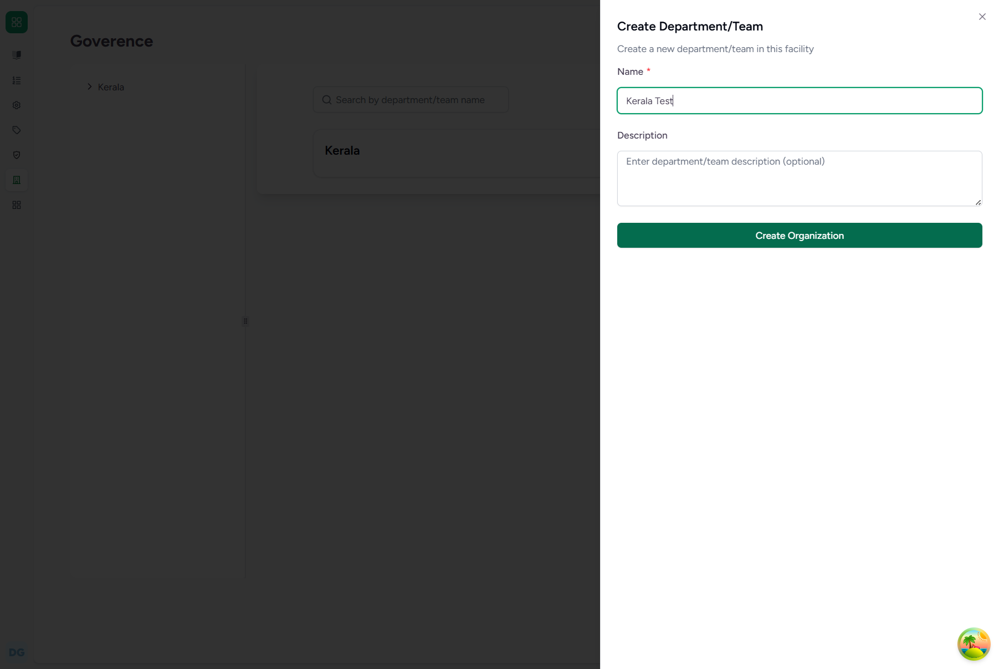
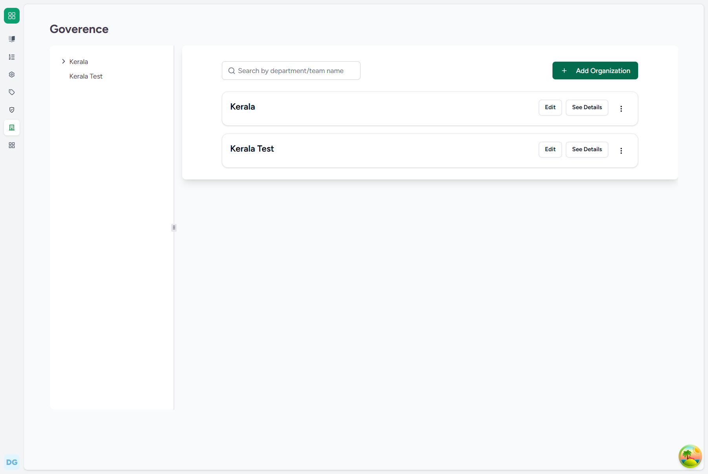
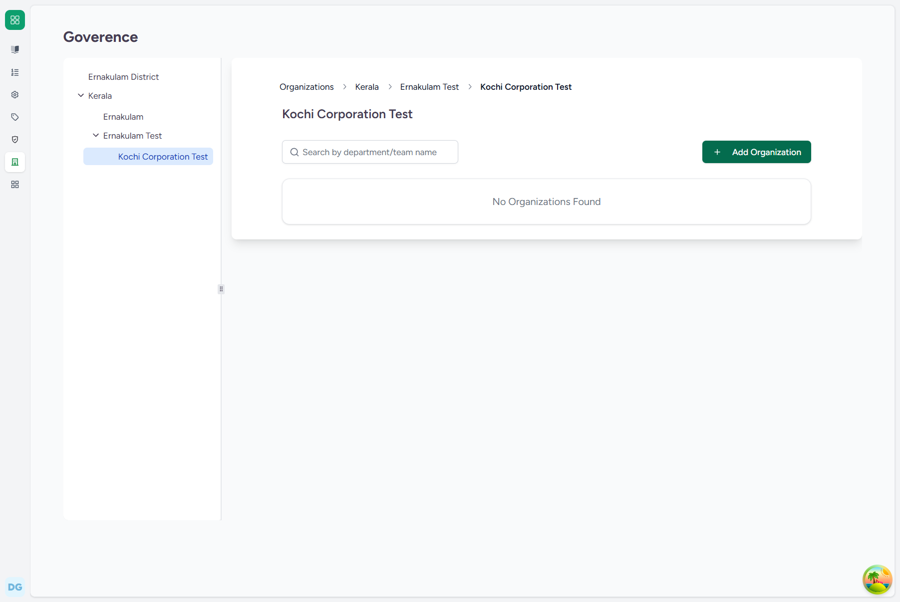
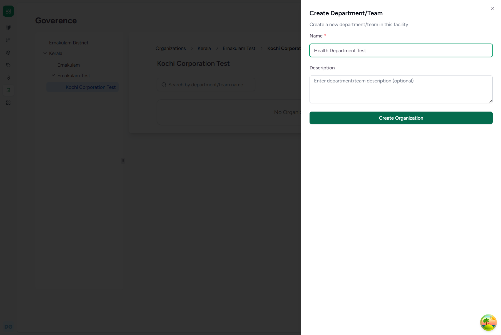
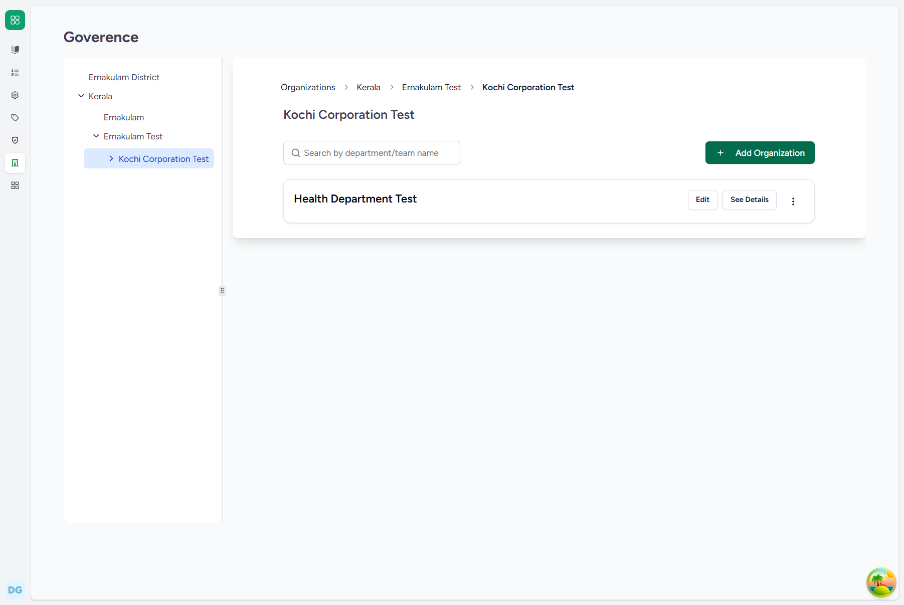
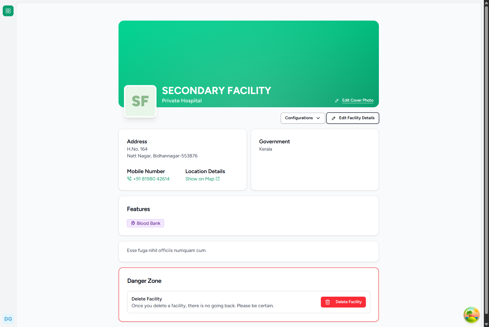
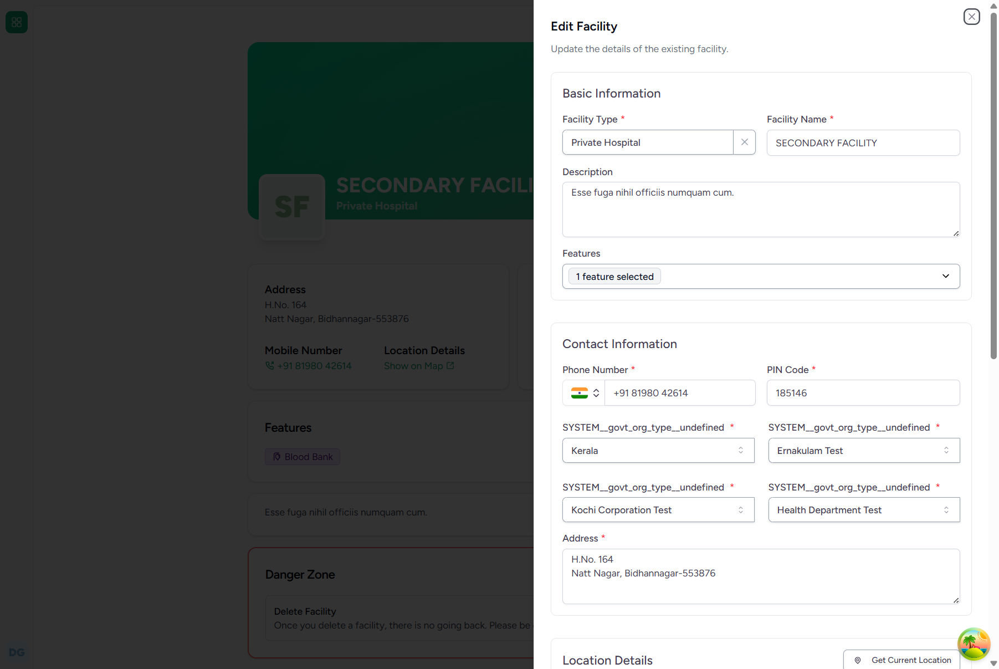
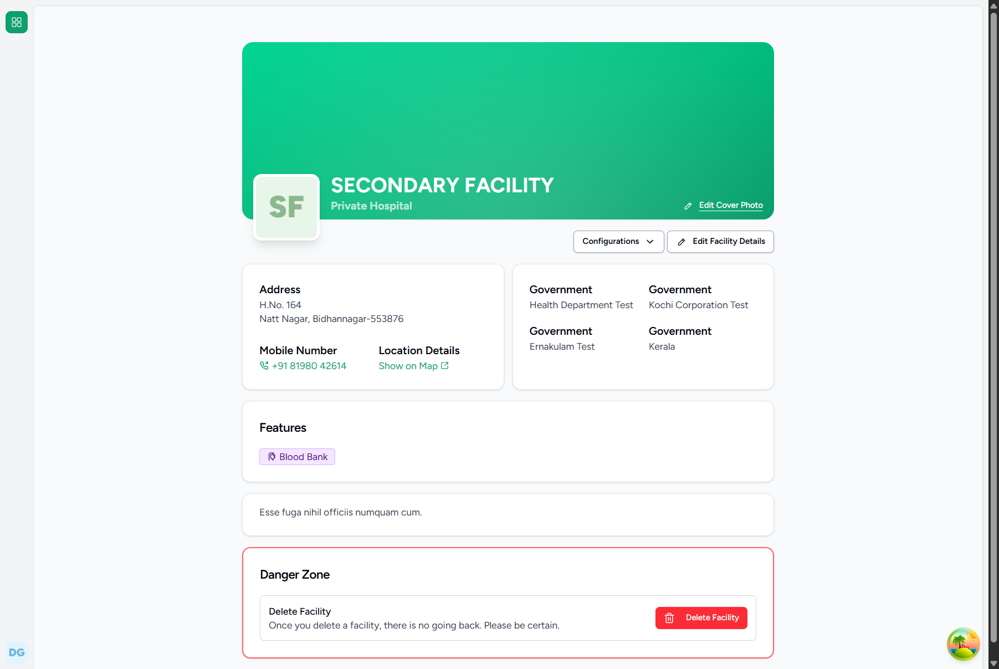

# Domain A: Governance & Organization Hierarchy

Care EMR implements a hierarchical governance model using self-referential organizations to represent state, district, and local body levels. This document guides administrative users through the step-by-step processes to construct a governance hierarchy and link geographic boundaries to medical facilities.

---

## Default Super Admin Credentials
For all the workflows below, authenticate using the following Super Admin credentials:
* **Login URL**: `http://localhost:4000/`
* **Username**: `care-admin`
* **Password**: `Ohcn@123`

---

## FLOW-01: Creating a State Organization (e.g., Kerala)

### Objective
Create a root-level organization of type `Government` representing a State.

### Step-by-Step UI Process
1. Navigate to the login page at `http://localhost:4000/`.
2. Input username `care-admin` and password `Ohcn@123`, then click **Login**.
3. Once logged in, click on your profile/avatar in the sidebar or top navigation and select **Organizations** (or navigate to `http://localhost:4000/admin/organizations`).
4. Click the **Add Organization** button.
5. In the creation form:
   * **Name**: Enter the state name (e.g., `Kerala`).
   * **Organization Type**: Select `govt` (Government).
   * **Parent Organization**: Leave empty (since this is a root-level State organization).
6. Click the **Submit** button to create the state.

### Screenshots

*Figure 1.1: Login Page*

*Figure 1.2: System Dashboard*

*Figure 1.3: Organizations Listing Page*

*Figure 1.4: State Organization Creation Form*

*Figure 1.5: State Organization Created Successfully*

### Backend Technical Flow & Database Mapping
* **Django Model**: `Organization` (located in [organization.py](file:///c:/Projects/HealthcareSystems/care/care/emr/models/organization.py))
* **Database Table**: `emr_organization`
* **Fields Written**:
  * `id`: `UUID` (Generated automatically)
  * `name`: `"Kerala"`
  * `org_type`: `"govt"`
  * `parent_id`: `NULL`
  * `has_children`: `True`
  * `level_cache`: `0`
  * `parent_cache`: `[]`

---

## FLOW-02: Creating a District Organization (under the State)

### Objective
Create a child organization of type `Government` representing a District (e.g., `Ernakulam Test`) under a root-level State.

### Step-by-Step UI Process
1. Go to the **Organizations** panel.
2. Select the state created in FLOW-01 (`Kerala`) to open its organization detail page.
3. Click the **Add Organization** (or child organization) button.
4. In the child organization form:
   * **Name**: Enter the district name (e.g., `Ernakulam Test`).
   * **Organization Type**: Select `govt` (Government).
   * **Parent Organization**: Set as `Kerala` (often pre-populated).
5. Click **Submit** to finalize creation.

### Screenshots

*Figure 2.1: State Organization Details View*

*Figure 2.2: District Child Organization Form*

*Figure 2.3: District Organization Successfully Registered*

### Backend Technical Flow & Database Mapping
* **Django Model**: `Organization`
* **Database Table**: `emr_organization`
* **Fields Written**:
  * `name`: `"Ernakulam Test"`
  * `org_type`: `"govt"`
  * `parent_id`: `[Kerala UUID]`
  * `level_cache`: `1`
  * `parent_cache`: `[Kerala_UUID]`

---

## FLOW-03: Creating a Local Body Organization (under the District)

### Objective
Create a child organization of type `Government` representing a Local Body (e.g., `Kochi Corporation Test`) under a District organization.

### Step-by-Step UI Process
1. Go to the **Organizations** panel.
2. Open the details page for the parent district (`Ernakulam Test`).
3. Click the **Add Organization** button.
4. In the child organization form:
   * **Name**: Enter the local body name (e.g., `Kochi Corporation Test`).
   * **Organization Type**: Select `govt` (Government).
   * **Parent Organization**: Set as `Ernakulam Test`.
5. Click **Submit** to finalize creation.

### Screenshots

*Figure 3.1: District Details View*

*Figure 3.2: Local Body Form*

*Figure 3.3: Local Body Registered Successfully*

### Backend Technical Flow & Database Mapping
* **Django Model**: `Organization`
* **Database Table**: `emr_organization`
* **Fields Written**:
  * `name`: `"Kochi Corporation Test"`
  * `org_type`: `"govt"`
  * `parent_id`: `[Ernakulam Test UUID]`
  * `level_cache`: `2`
  * `parent_cache`: `[Kerala_UUID, Ernakulam_Test_UUID]`

---

## FLOW-04: Creating a Health Department Organization (under the Local Body)

### Objective
Create a child organization of type `Government` representing a Department (e.g., `Health Department Test`) under a Local Body.

### Step-by-Step UI Process
1. Go to the **Organizations** panel.
2. Open the details page for the parent local body (`Kochi Corporation Test`).
3. Click the **Add Organization** button.
4. In the child organization form:
   * **Name**: Enter the department name (e.g., `Health Department Test`).
   * **Organization Type**: Select `govt` (Government).
   * **Parent Organization**: Set as `Kochi Corporation Test`.
5. Click **Submit** to finalize creation.

### Screenshots

*Figure 4.1: Local Body Details View*

*Figure 4.2: Department Form*

*Figure 4.3: Department Registered Successfully*

### Backend Technical Flow & Database Mapping
* **Django Model**: `Organization`
* **Database Table**: `emr_organization`
* **Fields Written**:
  * `name`: `"Health Department Test"`
  * `org_type`: `"govt"`
  * `parent_id`: `[Kochi Corporation Test UUID]`
  * `level_cache`: `3`
  * `parent_cache`: `[Kerala_UUID, Ernakulam_Test_UUID, Kochi_Corporation_Test_UUID]`

---

## FLOW-05: Linking Geographic Governance Boundaries to Facilities

### Objective
Associate a clinical facility with its governing geographic boundary organization (e.g., `Health Department Test`) to ensure proper administrative alignment and support localized querying.

### Step-by-Step UI Process
1. Open the general settings page for the target facility (e.g., `SECONDARY FACILITY`) at `http://localhost:4000/facility/[Facility_UUID]/settings/general`.
2. Click the **Edit Facility Details** button to open the configuration modal.
3. Scroll to the **Geographic Boundary** fields. A cascade of dropdown lists will render:
   * **State/Root**: Select `Kerala`.
   * **District**: Select `Ernakulam Test`.
   * **Local Body**: Select `Kochi Corporation Test`.
   * **Department**: Select `Health Department Test`.
4. Once the full tree is selected, click **Update Facility**.
5. The settings page will reload, now displaying the complete hierarchical administrative link under the "Government" details list:
   * `Government: Health Department Test`
   * `Government: Kochi Corporation Test`
   * `Government: Ernakulam Test`
   * `Government: Kerala`

### Screenshots

*Figure 5.1: Edit Facility Configuration Modal*

*Figure 5.2: Completed Cascading Boundary Selection*

*Figure 5.3: Facility Profile showing Saved Geographic Government Hierarchy*

### Backend Technical Flow & Database Mapping
* **Django Model**: `Facility` (located in [facility.py](file:///c:/Projects/HealthcareSystems/care/care/facility/models/facility.py))
* **Database Table**: `facility_facility`
* **Fields Written**:
  * `geo_organization_id`: `[Health Department Test UUID]`
  * `geo_organization_cache`: `[Kerala_UUID, Ernakulam_Test_UUID, Kochi_Corporation_Test_UUID, Health_Department_Test_UUID]` (Updated automatically via `sync_cache()` hooks on the backend model to optimize recursive regional reporting queries).
