# Domain B: Facility & Spatial Location Administration

Care EMR supports comprehensive facility profiling and hierarchical spatial location mapping. This allows administrators to register facilities (e.g., hospitals, diagnostic labs) and construct internal spatial trees (Blocks, Wings, Rooms, and Beds) for patient placement and routing.

---

## Default Super Admin Credentials
For all the workflows below, authenticate using the following Super Admin credentials:
* **Login URL**: `http://localhost:4000/`
* **Username**: `care-admin`
* **Password**: `Ohcn@123`

---

## FLOW-06: Registering a Hospital / Clinical Facility

### Objective
Register a new physical hospital or clinical facility (e.g., `Ernakulam General Hospital`) in the system.

### Step-by-Step UI Process
1. Log in to the application and navigate to the **Facilities** panel (or visit `http://localhost:4000/facility`).
2. Click the **Create Facility** button in the top right.
3. In the creation form:
   * **Facility Name**: Enter `Ernakulam General Hospital`.
   * **Facility Type**: Select `District Hospital`.
   * **Address**: Fill in the geographic address details.
   * **Phone Number**: Enter a valid contact number.
4. Click **Create** to register the facility.

### Screenshots
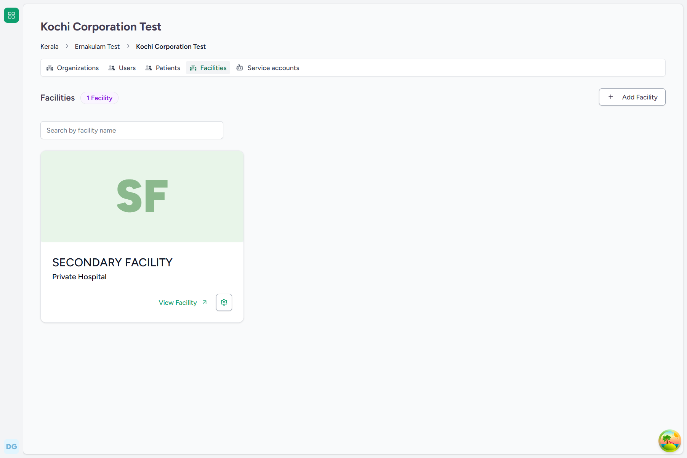
*Figure 6.1: Facilities Dashboard showing the Create Facility option*

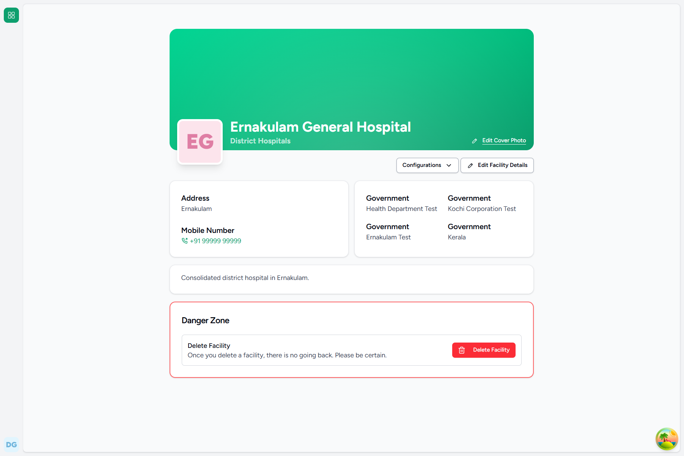
*Figure 6.2: Newly Registered Hospital Detail View*

### Backend Technical Flow & Database Mapping
* **Django Model**: `Facility` (located in [facility.py](file:///c:/Projects/HealthcareSystems/care/care/facility/models/facility.py))
* **Database Table**: `facility_facility`
* **Fields Written**:
  * `id`: `UUID` (Generated automatically)
  * `name`: `"Ernakulam General Hospital"`
  * `facility_type`: `13` (Integer code representing District Hospital)
  * `phone_number`: `"+919876543210"`
* **Automation**: Creates a root `FacilityOrganization` record named "Administration" linked to the facility.

---

## FLOW-07: Creating a Dedicated Laboratory Facility (e.g. Govt Lab)

### Objective
Register a standalone laboratory facility (e.g., `Govt Diagnostic Lab Kochi`) to handle diagnostic orders.

### Step-by-Step UI Process
1. Navigate to the **Facilities** panel and click **Create Facility**.
2. In the creation form:
   * **Facility Name**: Enter `Govt Diagnostic Lab Kochi`.
   * **Facility Type**: Select `Govt Labs` or `Private Labs`.
   * **Address**: Fill in the physical address.
   * **Phone Number**: Enter a valid contact number.
3. Click **Create** to register the laboratory facility.

### Screenshots
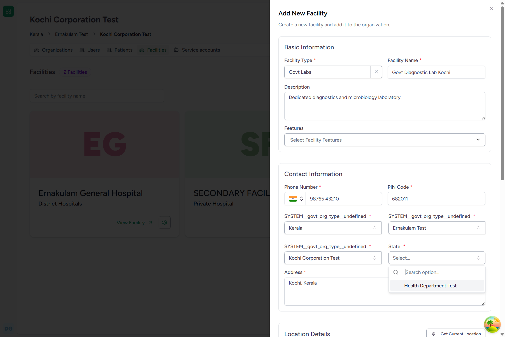
*Figure 7.1: Laboratory Facility Registration Form*

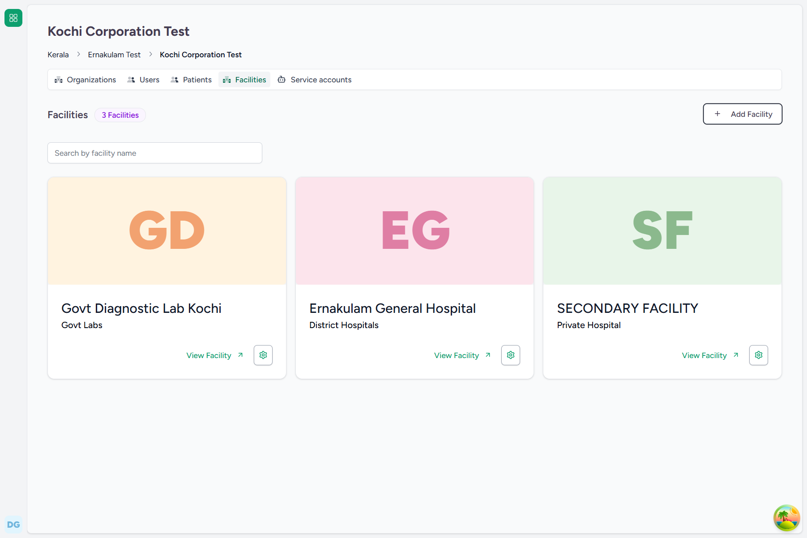
*Figure 7.2: Standalone Laboratory Created Successfully*

### Backend Technical Flow & Database Mapping
* **Django Model**: `Facility` (located in [facility.py](file:///c:/Projects/HealthcareSystems/care/care/facility/models/facility.py))
* **Database Table**: `facility_facility`
* **Fields Written**:
  * `name`: `"Govt Diagnostic Lab Kochi"`
  * `facility_type`: `9` (Integer code representing Govt Labs)

---

## FLOW-08: Creating Building Wings / Blocks inside a Facility

### Objective
Establish the top-level parent spatial location (e.g., `Block A`) inside a registered facility to start building the spatial hierarchy.

### Step-by-Step UI Process
1. From the facility dashboard, navigate to the **Settings** or **Locations** section.
2. Under the Locations tab, click the **Add Location** button.
3. In the location form:
   * **Location Name**: Enter `Block A`.
   * **Location Type**: Select `Building` or `Wing`.
   * **Parent Location**: Leave empty (representing a root location within the facility).
4. Click **Submit** to save.

### Screenshots
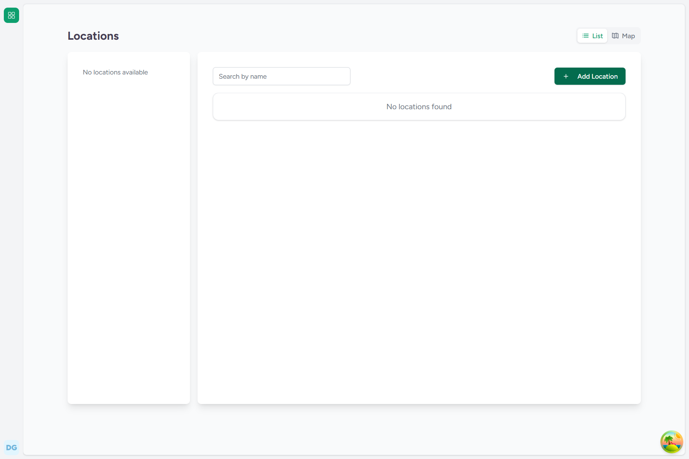
*Figure 8.1: Facility Locations Overview*

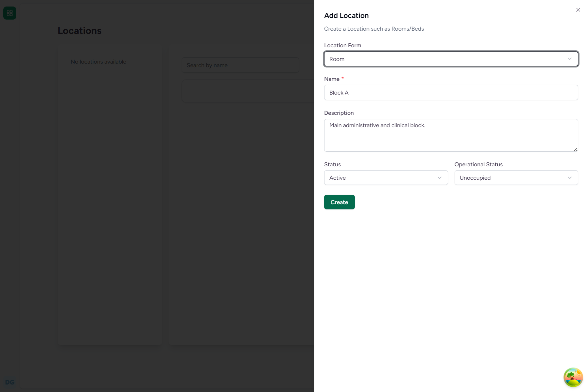
*Figure 8.2: Wing/Block Creation Form*

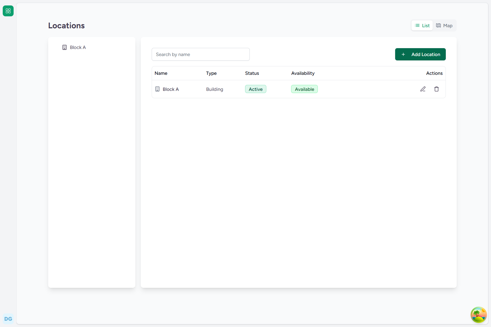
*Figure 8.3: Top-level Location Block A Created*

### Backend Technical Flow & Database Mapping
* **Django Model**: `FacilityLocation` (located in [location.py](file:///c:/Projects/HealthcareSystems/care/care/emr/models/location.py))
* **Database Table**: `emr_facilitylocation`
* **Fields Written**:
  * `id`: `UUID` (Generated automatically)
  * `name`: `"Block A"`
  * `parent_id`: `NULL`
  * `level_cache`: `0`
  * `root_location_id`: `NULL`
  * `has_children`: `False`

---

## FLOW-09: Creating Wards & Rooms inside a Wing

### Objective
Create nested room or ward locations (e.g., `Room 201`) subordinate to a building wing/block.

### Step-by-Step UI Process
1. Navigate to the Locations tab of the facility settings.
2. Click **Add Location**.
3. In the form:
   * **Location Name**: Enter `Room 201`.
   * **Location Type**: Select `Room` or `Ward`.
   * **Parent Location**: Select `Block A` from the dropdown list.
4. Click **Submit** to save.

### Screenshots
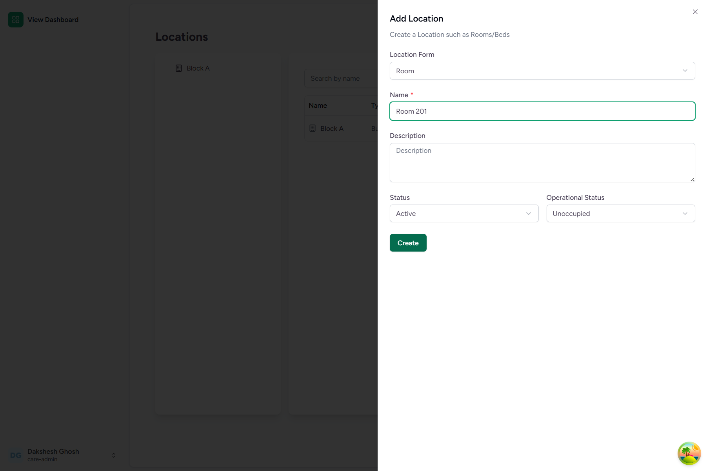
*Figure 9.1: Room/Ward Creation Form*

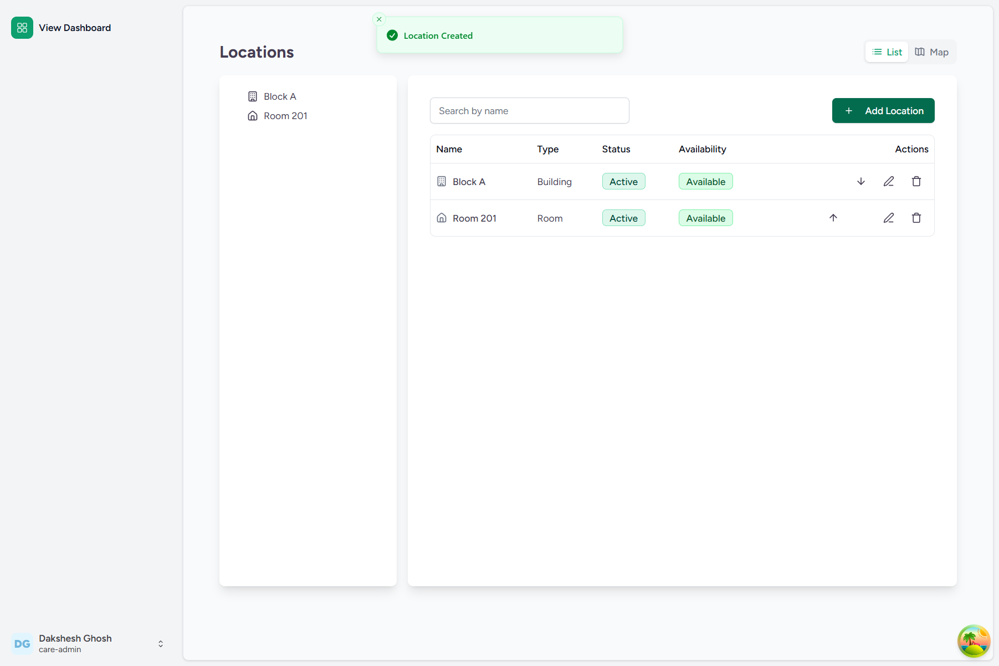
*Figure 9.2: Room 201 Displayed in Location Hierarchy*

### Backend Technical Flow & Database Mapping
* **Django Model**: `FacilityLocation` (located in [location.py](file:///c:/Projects/HealthcareSystems/care/care/emr/models/location.py))
* **Database Table**: `emr_facilitylocation`
* **Fields Written**:
  * `name`: `"Room 201"`
  * `parent_id`: `[Block A UUID]`
  * `level_cache`: `1`
  * `root_location_id`: `[Block A UUID]`
* **State Updates**: Updates parent location (`Block A`) to set `has_children = True`.

---

## FLOW-10: Registering Beds under a Room

### Objective
Define individual clinical bed slots (e.g., `Bed 104`) nested inside a ward or room, setting their statuses for occupancy tracking.

### Step-by-Step UI Process
1. Under the facility's Locations panel, click **Add Location**.
2. In the location form:
   * **Location Name**: Enter `Bed 104`.
   * **Location Type**: Select `Bed`.
   * **Parent Location**: Select `Room 201` from the dropdown list.
3. Click **Submit** to finalize the location structure.

### Screenshots
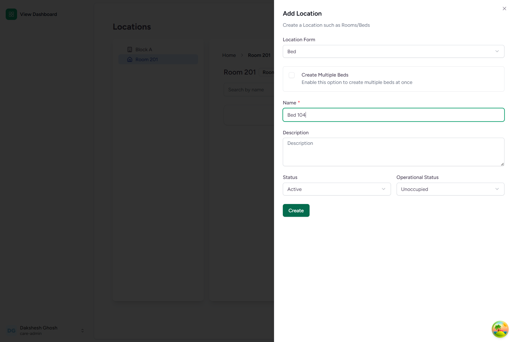
*Figure 10.1: Bed Creation Form*

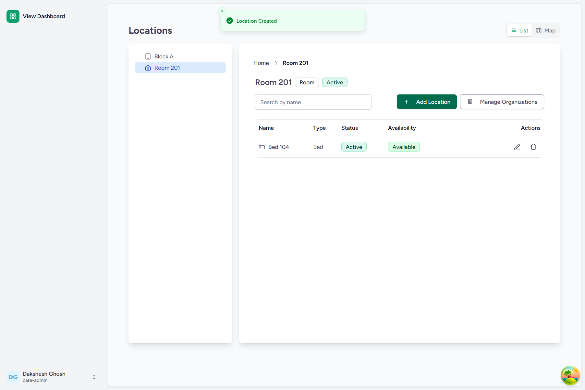
*Figure 10.2: Completed Spatial Tree (Block A > Room 201 > Bed 104)*

### Backend Technical Flow & Database Mapping
* **Django Model**: `FacilityLocation` (located in [location.py](file:///c:/Projects/HealthcareSystems/care/care/emr/models/location.py))
* **Database Table**: `emr_facilitylocation`
* **Fields Written**:
  * `name`: `"Bed 104"`
  * `parent_id`: `[Room 201 UUID]`
  * `level_cache`: `2`
  * `status`: `"active"`
  * `operational_status`: `"unoccupied"`
* **State Updates**: Updates parent location (`Room 201`) to set `has_children = True`.
