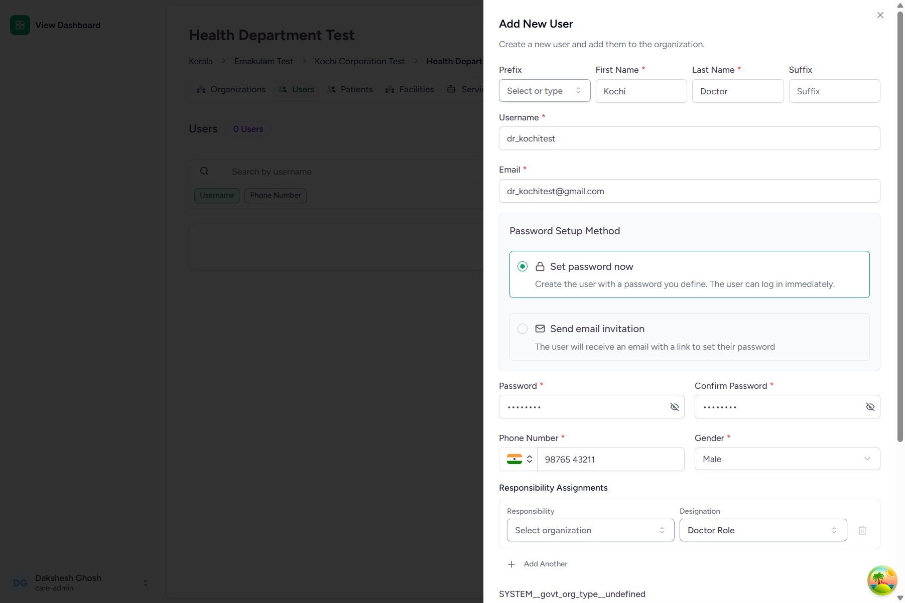
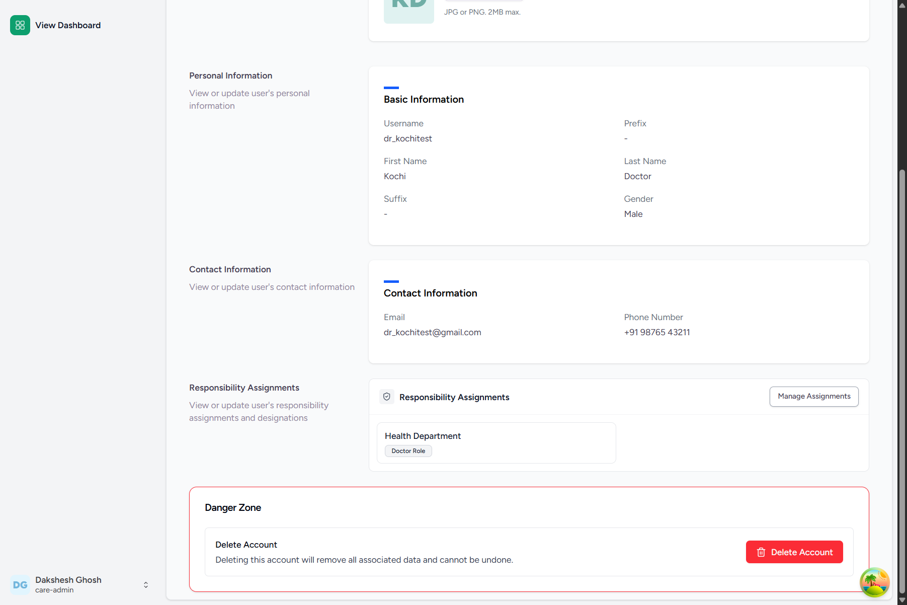
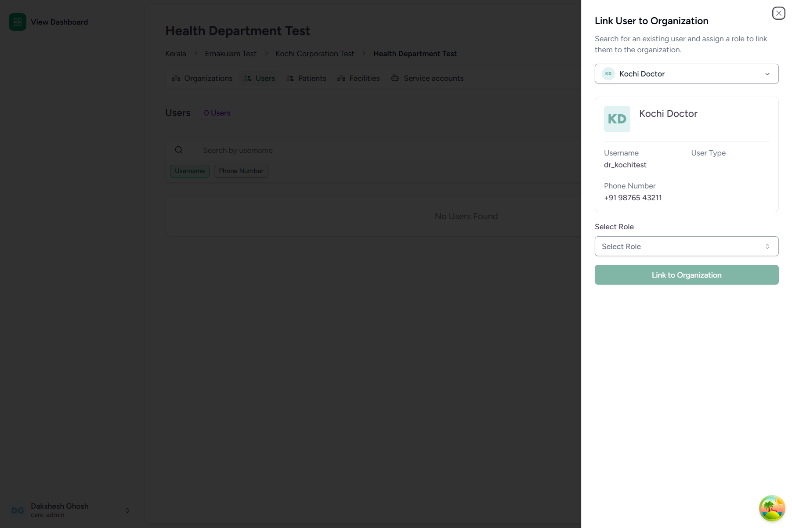
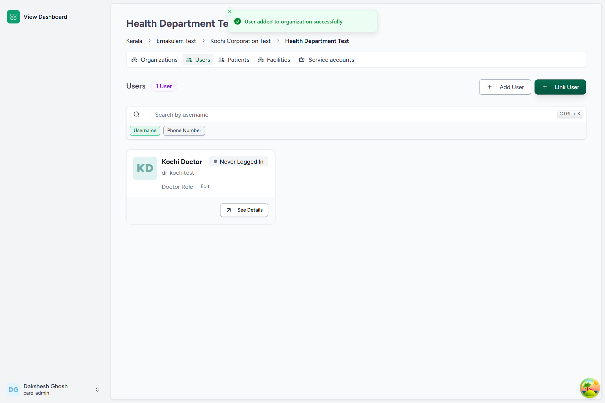
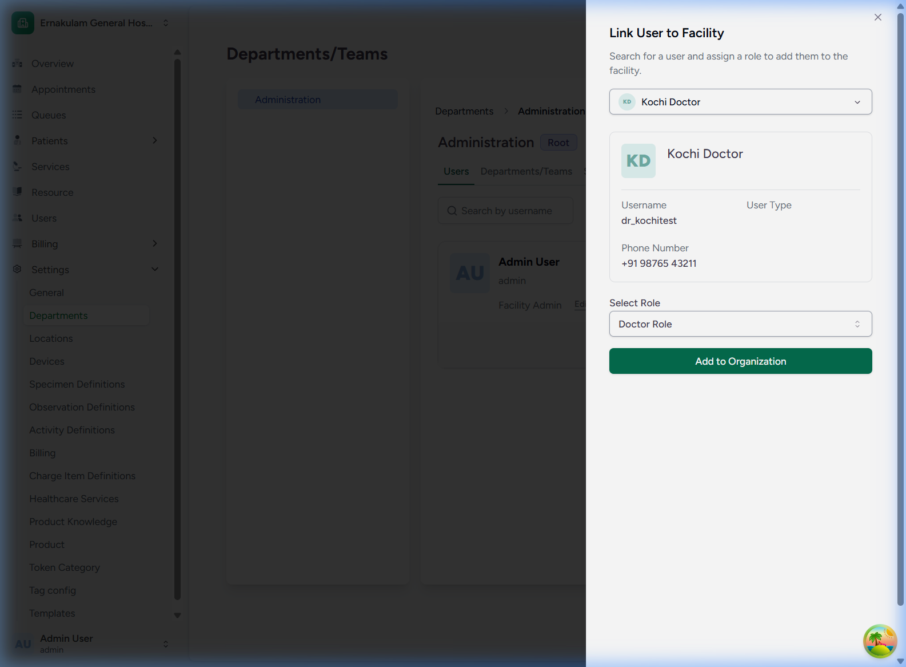
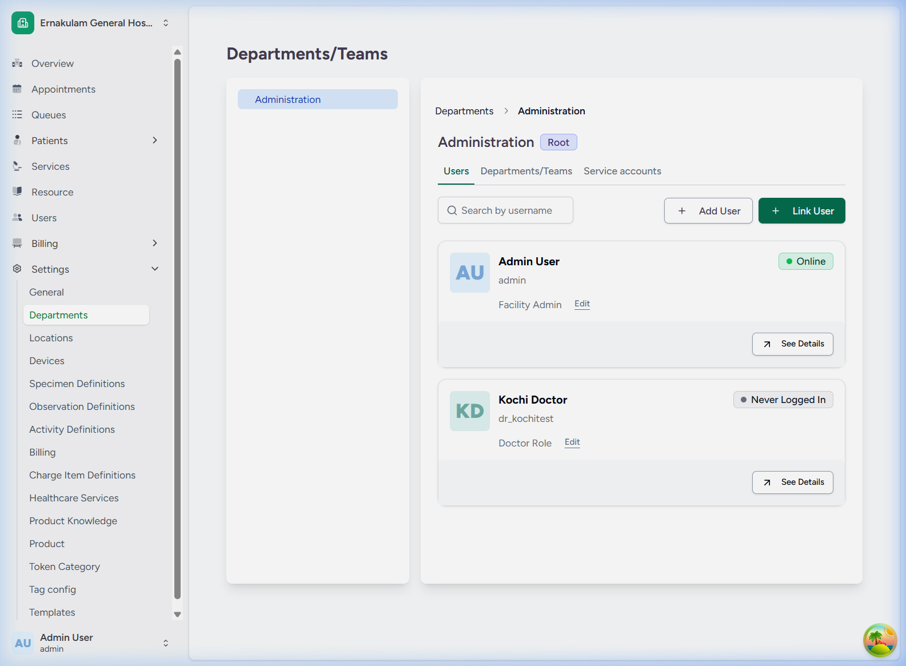
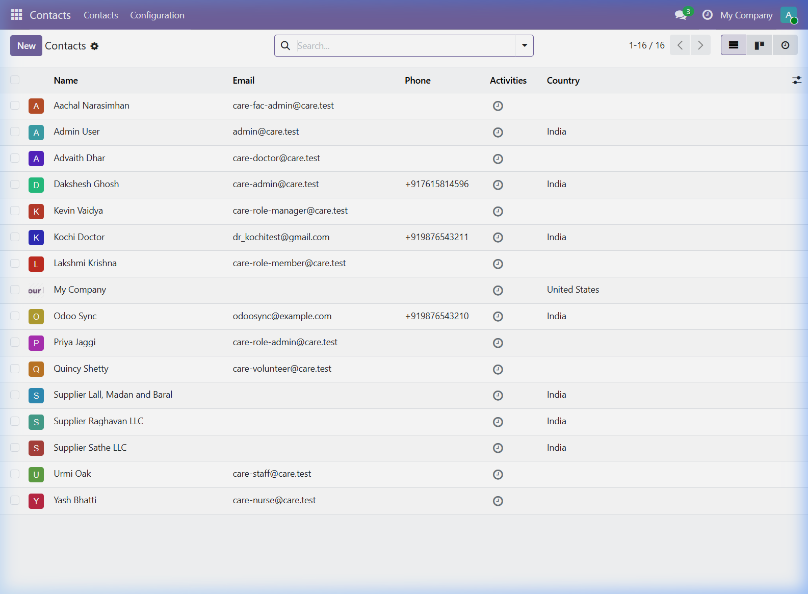

# Domain C: User Management & Role Allotment

Care EMR implements a robust, secure role-based access control (RBAC) model. Users can be registered in the system, assigned designations, linked to geographic governance organizations, and associated with specific facility-level internal organizations (departments). Critical user creation events are replicated in real-time to the Odoo ERP system.

---

## Default Super Admin Credentials
For all the workflows below, authenticate using the following Super Admin credentials:
* **Login URL**: `http://localhost:4000/`
* **Username**: `care-admin`
* **Password**: `Ohcn@123`

---

## FLOW-11: Creating a New System User Account

### Objective
Create a new clinical or administrative user profile in the EMR and verify automated synchronization into Odoo ERP.

### Step-by-Step UI Process
1. Log in as a Super Admin and navigate to the **Users** management page (or go to `http://localhost:4000/admin/users`).
2. Click the **Add New User** button.
3. In the creation form, fill out:
   * **Username**: `dr_kochitest`
   * **First Name**: `Kochi`
   * **Last Name**: `Doctor`
   * **Email**: `dr_kochitest@gmail.com`
   * **Phone Number**: `+919876543211`
   * **Password**: Fill in a secure password.
4. Click the **Create User** button.

### Screenshots

*Figure 11.1: EMR User Creation Form*

### Backend Technical Flow & Database Mapping
* **EMR Django Model**: `User` (located in [models.py](file:///c:/Projects/HealthcareSystems/care/users/models.py))
* **EMR Database Table**: `users_user`
* **Fields Written**:
  * `id`: `Integer` (Primary Key auto-incremented)
  * `username`: `"dr_kochitest"`
  * `first_name`: `"Kochi"`
  * `last_name`: `"Doctor"`
  * `email`: `"dr_kochitest@gmail.com"`
  * `phone_number`: `"+919876543211"`
* **Odoo ERP Sync Integration**: A backend post-save signal dispatches a creation payload to the Odoo ERP connector via FastAPI. The connector replicates the user as:
  * A Partner in the `res_partner` table.
  * An Odoo System User in the `res_users` table.

---

## FLOW-12: Allotting Roles & Designations

### Objective
Allot designations (e.g., `Doctor Role`) to user profiles to satisfy organizational role-binding rules.

### Step-by-Step UI Process
1. Open the user profile page for the newly created user (e.g. `dr_kochitest`) at `http://localhost:4000/users/dr_kochitest`.
2. Scroll to the **Designations & Responsibilities** section.
3. Choose the required designation (e.g., `Doctor Role`).
4. Click **Assign Designation** to save changes.

### Screenshots

*Figure 12.1: User Profile showing Allotted Designation*

### Backend Technical Flow & Database Mapping
* **Django Model**: `User` (profile mappings)
* **Database Table**: `users_user`
* **Validation**: Restricts administrative permissions based on context: organization-level roles require designated and authorized credentials.

---

## FLOW-13: Linking Users to Geographic Organizations (`OrganizationUser`)

### Objective
Associate a user with a geographic governance organization (e.g., `Health Department Test`), defining their administrative boundary and scope of authority.

### Step-by-Step UI Process
1. Go to the **Organizations** panel.
2. Select the `Health Department Test` organization.
3. Click the **Add User** (or link user) button.
4. In the user mapping form:
   * **User**: Search and select `dr_kochitest` (Kochi Doctor).
   * **Role**: Select `Clinical Manager` or the matching role definition.
5. Click **Save** to map the user.

### Screenshots

*Figure 13.1: Geographic Organization User Assignment Form*

*Figure 13.2: Linked User Listed under Health Department Test*

### Backend Technical Flow & Database Mapping
* **Django Model**: `OrganizationUser` (located in [organization.py](file:///c:/Projects/HealthcareSystems/care/care/emr/models/organization.py))
* **Database Table**: `emr_organizationuser`
* **Fields Written**:
  * `id`: `UUID` (Generated automatically)
  * `organization_id`: `[Health Department Test UUID]`
  * `user_id`: `[dr_kochitest ID]`
  * `role_id`: `[Clinical Manager Role UUID]`

---

## FLOW-14: Linking Users to Facility Administration (`FacilityOrganizationUser`)

### Objective
Link a user to a specific department or internal sub-organization of a clinical facility (e.g., the `Administration` department of `Ernakulam General Hospital`).

### Step-by-Step UI Process
1. Navigate to the facility dashboard for `Ernakulam General Hospital`.
2. Go to **Settings > Departments** and select the `Administration` department.
3. Navigate to the **Users** tab of the Administration department and click the **Link User** button.
4. In the mapping form:
   * **User**: Search and select `dr_kochitest` (Kochi Doctor).
   * **Role**: Select `Doctor Role` (or `Facility Admin`).
5. Click **Add to Organization** (Submit).
6. Verify that the user is now displayed in the linked users list.
7. Open Odoo ERP at `http://localhost:8069/` and navigate to the **Contacts** module to verify replication.

### Screenshots

*Figure 14.1: Facility Department User Association Form*

*Figure 14.2: Kochi Doctor Displayed in the Administration Department Users List*

*Figure 14.3: Odoo Contacts Module verifying dr_kochitest Partner Replication*

### Backend Technical Flow & Database Mapping
* **Django Model**: `FacilityOrganizationUser` (located in [organization.py](file:///c:/Projects/HealthcareSystems/care/care/emr/models/organization.py))
* **Database Table**: `emr_facilityorganizationuser`
* **Fields Written**:
  * `id`: `UUID` (Generated automatically)
  * `organization_id`: `[Administration Department UUID]` (references a `FacilityOrganization` record)
  * `user_id`: `[dr_kochitest ID]`
  * `role_id`: `[Doctor Role UUID]`
* **Odoo Integration**: Confirms partner replication under the `res_partner` table matching EMR credentials.
