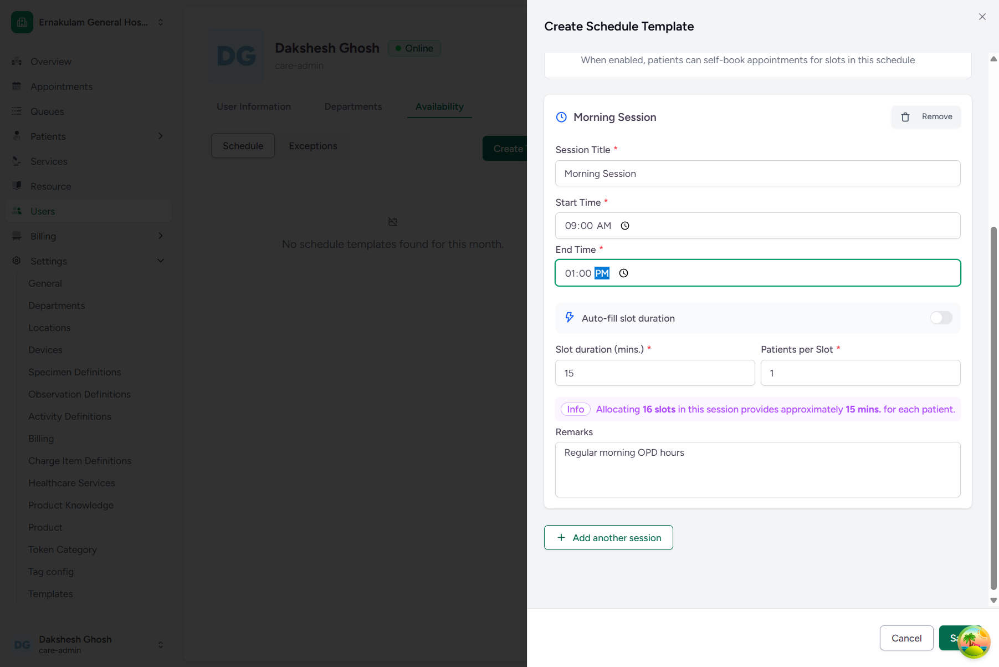
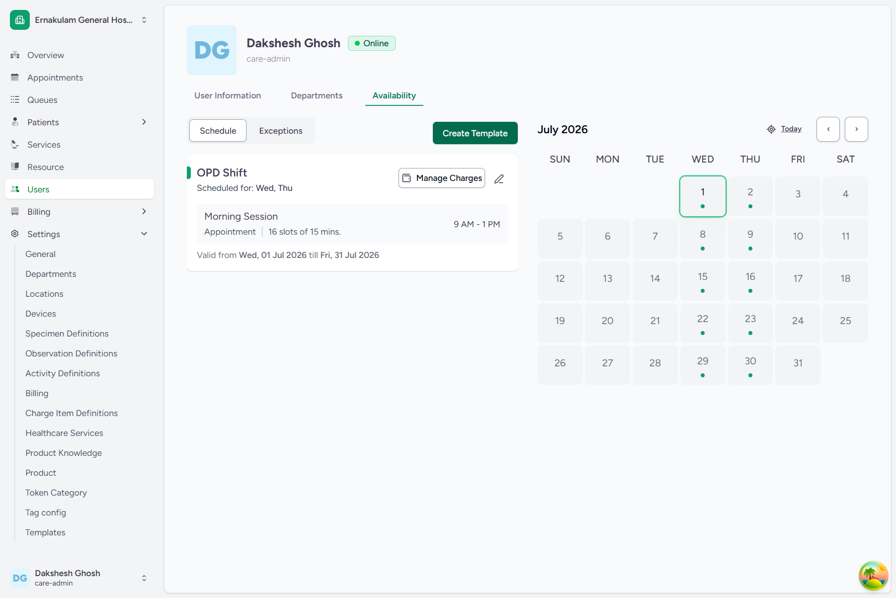
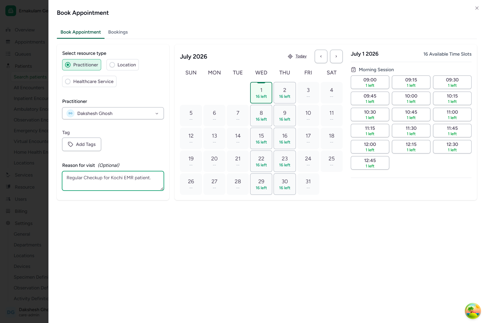
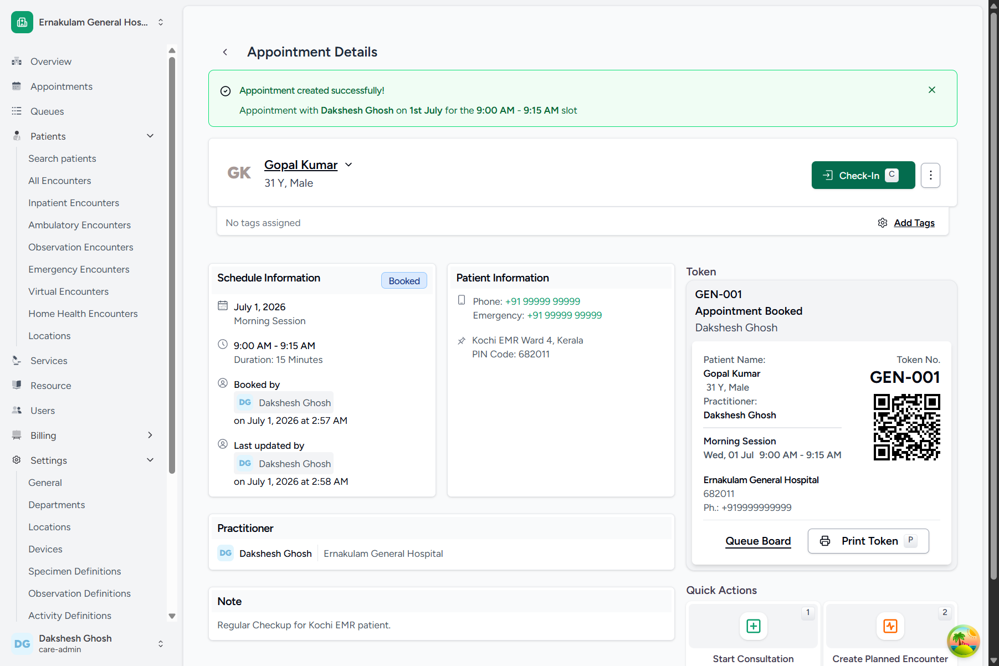
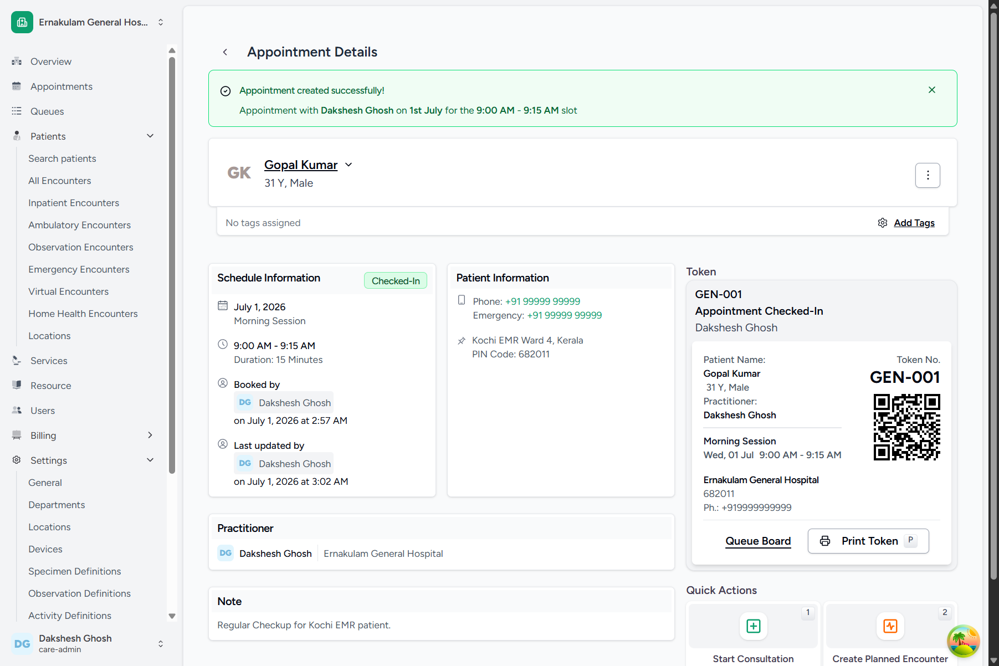
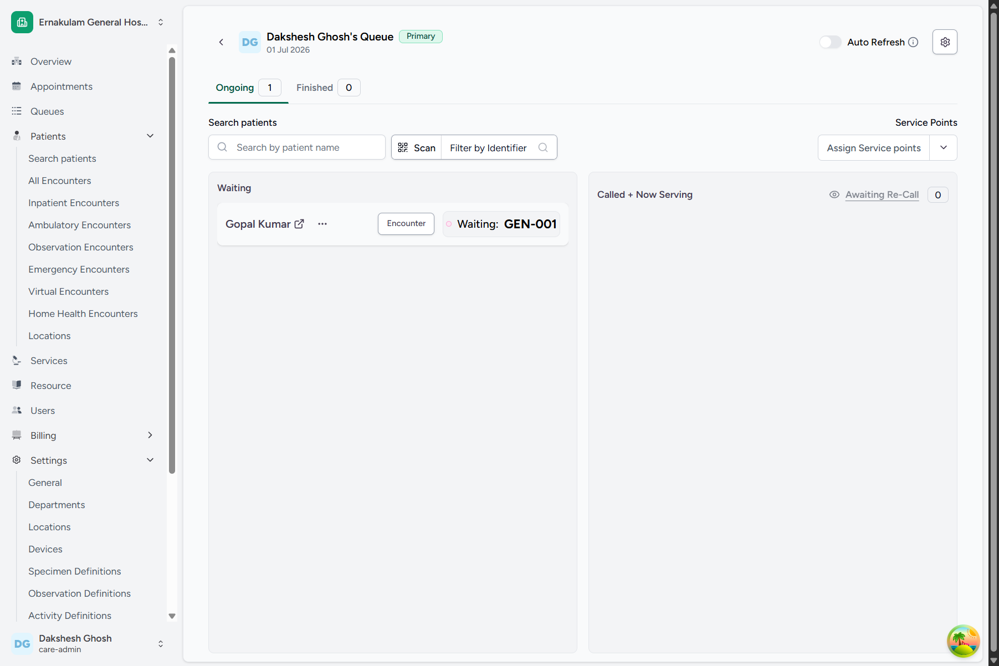

# Domain D: Scheduling & Appointment Booking

CARE EMR supports full practitioner availability scheduling, patient public booking, and a real-time token/queue system. This document details the step-by-step processes to configure schedules, book patient appointments, generate session tokens, and manage the check-in and waiting queue flows.

---

## Default Super Admin Credentials
For all the workflows below, authenticate using the following Super Admin credentials:
* **Login URL**: `http://localhost:4000/`
* **Username**: `care-admin`
* **Password**: `Ohcn@123`

---

## FLOW-15: Creating Doctor Schedule Availability Slots

### Objective
Configure a weekly recurring availability schedule template for a practitioner (`Dakshesh Ghosh`) at a facility (`Ernakulam General Hospital`) and generate bookable slot sessions.

### Step-by-Step UI Process
1. Navigate to the login page at `http://localhost:4000/` and authenticate as `care-admin`.
2. Select **Ernakulam General Hospital** from your facility dashboard list.
3. Click on the profile card of **Dakshesh Ghosh** under **Users** or via the sidebar (or navigate directly to his user profile page).
4. Click **Manage Slots** -> **Create Template**.
5. In the Create Schedule Template form:
   * **Template Name**: Enter `"OPD Shift"`.
   * **Shift Start Date**: Select `July 1, 2026`.
   * **Shift End Date**: Select `July 31, 2026`.
   * **Availability Rules**: Check **Wednesday** and **Thursday**.
   * **Shift Start Time**: Enter `09:00 AM`.
   * **Shift End Time**: Enter `01:00 PM`.
   * **Slot Size**: Set to `15` minutes.
6. Click **Save Template** to generate all bookable slot sessions automatically for the entire month of July 2026.

### Screenshots

*Figure 15.1: Create Schedule Template Sheet*

*Figure 15.2: Generated Bookable Slots Calendar View*

### Backend Technical Flow & Database Mapping
* **Django Models**: `ScheduleTemplate`, `ScheduleTemplateAvailability` (located in [schedule.py](file:///c:/Projects/HealthcareSystems/care/care/emr/models/scheduling/schedule.py))
* **Database Tables**: `emr_scheduletemplate`, `emr_scheduletemplateavailability`, and `emr_tokenslot` (for generated individual bookable slots).
* **Fields Written (ScheduleTemplate)**:
  * `id`: `UUID` (Generated automatically)
  * `name`: `"OPD Shift"`
  * `valid_from`: `2026-07-01 00:00:00+00`
  * `valid_to`: `2026-07-31 23:59:59+00`
  * `facility_id`: `[Ernakulam General Hospital ID]`
* **Fields Written (ScheduleTemplateAvailability)**:
  * `day_of_week`: `[2, 3]` (Wednesday, Thursday)
  * `start_time`: `"09:00:00"`
  * `end_time`: `"13:00:00"`
  * `slot_size_in_minutes`: `15`

---

## FLOW-16: Patient Appointment Booking

### Objective
Book an appointment slot for a registered patient (`Gopal Kumar`) under practitioner `Dakshesh Ghosh` on a bookable slot date, and generate a consultation token.

### Step-by-Step UI Process
1. From the patient profile page for `Gopal Kumar`, click the **Schedule Appointment** button (or navigate to Bookings tab).
2. Select **Practitioner** as the resource type.
3. In the practitioner dropdown, search and click **Dakshesh Ghosh**.
4. In the reason for visit box, type `"Regular Checkup for Kochi EMR patient."`.
5. Under the July 2026 calendar, click on `July 1, 2026` (which shows "16 left" available slots).
6. Select the first morning slot: `09:00 AM - 09:15 AM`.
7. Click **Confirm Appointment** to book the slot.
8. On the appointment details success page, click **Generate Token**. Select the **General Consultation** category and click **Generate Token**.

### Screenshots

*Figure 16.1: Appointment Booking Details Form*

*Figure 16.2: Successful Appointment Booking & Session Token Generated*

### Backend Technical Flow & Database Mapping
* **Django Models**: `Appointment`, `Token` (located in [booking.py](file:///c:/Projects/HealthcareSystems/care/care/emr/models/scheduling/booking.py) and [token.py](file:///c:/Projects/HealthcareSystems/care/care/emr/models/scheduling/token.py))
* **Database Tables**: `emr_appointment`, `emr_token`
* **Fields Written (Appointment)**:
  * `id`: `UUID` (Generated automatically)
  * `patient_id`: `[Gopal Kumar ID]`
  * `token_slot_id`: `[TokenSlot ID representing 2026-07-01 09:00:00]`
  * `status`: `"booked"`
  * `reason_for_visit`: `"Regular Checkup for Kochi EMR patient."`
* **Fields Written (Token)**:
  * `token_number`: `"GEN-001"` (Automatically sequenced)
  * `token_category_id`: `[General Consultation Category ID]`
  * `status`: `"booked"`

---

## FLOW-17: Appointment Check-In & Queue Management

### Objective
Check-in the patient on arrival to change their appointment status from Booked to Checked-In, and verify their position inside the real-time Queue Board waiting list.

### Step-by-Step UI Process
1. Navigate to the appointment details page for `Gopal Kumar` (or click Appointments under patients).
2. Click the **Check-In** button.
3. The appointment state changes to **Checked-In**.
4. Click the **Queue Board** button to open the Practitioner Queue dashboard.
5. In the **Ongoing** tab of the queue dashboard, under the **Waiting** category, verify that `Gopal Kumar` is listed with token `"GEN-001"` and status `"Waiting"`.

### Screenshots

*Figure 17.1: Appointment Status Updated to Checked-In*

*Figure 17.2: Real-time Queue Board showing Patient in Waiting State*

### Backend Technical Flow & Database Mapping
* **Django Models**: `Appointment`, `Token`
* **Database Tables**: `emr_appointment`, `emr_token`
* **State Changes Executed**:
  * `emr_appointment.status`: Changed from `"booked"` to `"checked-in"`
  * `emr_token.status`: Changed from `"booked"` to `"waiting"`
  * `modified_date` updated to current timestamp.
