# Domain E: Clinical Patient Intake & Care

CARE EMR facilitates the complete patient lifecycle from registration, encounter creation, physical spatial allocation (beds), vital logs, clinical symptom monitoring, and discharge disposition workflows. This document outlines the step-by-step processes to manage these patient care activities.

---

## Default Practitioner Credentials
For all clinical workflows below, authenticate using the practitioner credentials:
* **Login URL**: `http://localhost:4000/`
* **Username**: `dr_kochitest`
* **Password**: `Ohcn@123`

---

## FLOW-18: Patient Registration

### Objective
Register a new patient (`Gopal Kumar`) into the EMR database under the facility (`Ernakulam General Hospital`).

### Step-by-Step UI Process
1. Navigate to the login page at `http://localhost:4000/` and authenticate as `dr_kochitest`.
2. Click **Ernakulam General Hospital** on the dashboard.
3. Click the **Register Patient** button on the patients list or overview page.
4. Fill in the Patient Registration Form:
   * **First Name**: `"Gopal"`
   * **Last Name**: `"Kumar"`
   * **Gender**: `"Male"`
   * **Date of Birth**: `1995-01-01`
   * **Phone Number**: `+919999999901`
   * **Address**: `"EMR Street, Kochi, Kerala"`
5. Click **Submit** to register the patient and generate a unique patient record.

### Screenshots
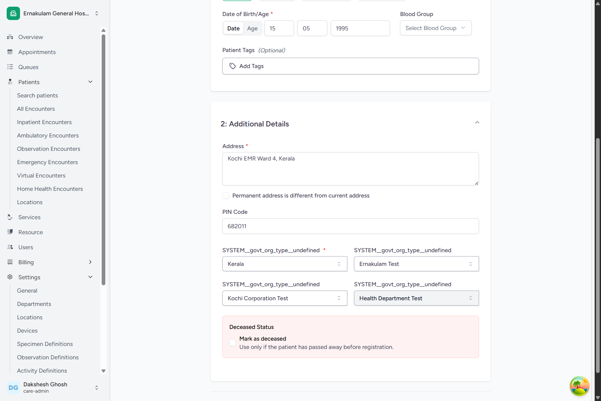
*Figure 18.1: Patient Registration Form*

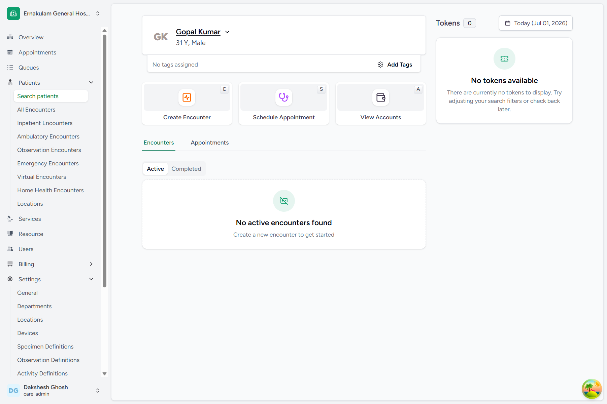
*Figure 18.2: Successfully Registered Patient Dashboard*

### Backend Technical Flow & Database Mapping
* **Django Model**: `Patient` (located in [patient.py](file:///c:/Projects/HealthcareSystems/care/care/emr/models/patient.py))
* **Database Table**: `emr_patient`
* **Fields Written**:
  * `id`: `UUID` (Generated automatically)
  * `first_name`: `"Gopal"`
  * `last_name`: `"Kumar"`
  * `gender`: `"male"`
  * `phone_number`: `"+919999999901"`
  * `date_of_birth`: `"1995-01-01"`

---

## FLOW-19: Creating a Patient Encounter

### Objective
Create an Inpatient encounter for `Gopal Kumar` to initiate clinical documentation and care tracking.

### Step-by-Step UI Process
1. Select the patient **Gopal Kumar** from the patient search directory.
2. Under the Encounters tab, click **Create Encounter**.
3. Fill in the Questionnaire form:
   * **Encounter Class**: Select **Inpatient**.
   * **Priority**: Select **Routine**.
   * **Admit Source**: Select **Emergency Department**.
4. Click **Submit** to create the encounter. The page will reload showing the encounter status as **In Progress** and **Ongoing**.

### Screenshots
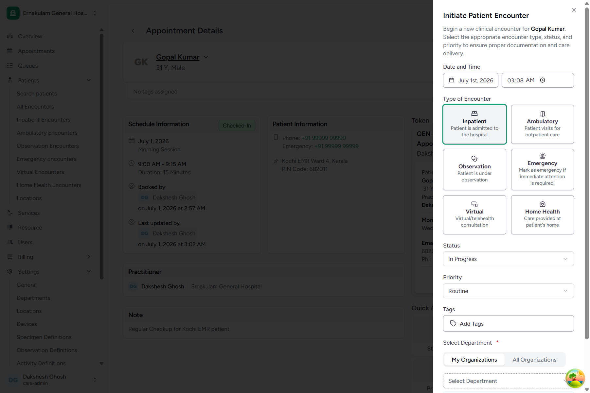
*Figure 19.1: Inpatient Encounter Intake Questionnaire*

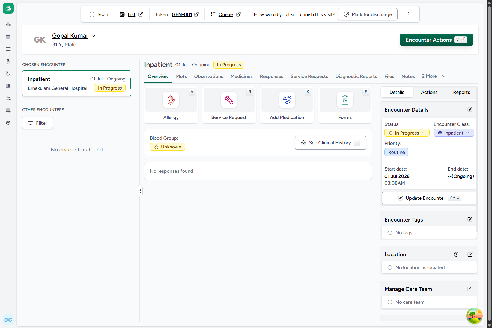
*Figure 19.2: Active Encounter Dashboard*

### Backend Technical Flow & Database Mapping
* **Django Model**: `Encounter` (located in [encounter.py](file:///c:/Projects/HealthcareSystems/care/care/emr/models/encounter.py))
* **Database Table**: `emr_encounter`
* **Fields Written**:
  * `id`: `UUID` (Generated automatically)
  * `patient_id`: `[Gopal Kumar ID]`
  * `status`: `"in-progress"`
  * `encounter_class`: `"imp"`
  * `priority`: `"routine"`
  * `facility_id`: `3`

---

## FLOW-20: Assigning Patient to Bed

### Objective
Select an available physical bed asset (`Bed 105` inside `Room 201`) to allot to `Gopal Kumar`.

### Step-by-Step UI Process
1. On the active encounter dashboard, click **Encounter Actions** (or press `⇧ + E`).
2. Search and click **Assign Location\nL**.
3. In the Location Switcher dialog, search and click **Room 201** -> **Bed 105**.
4. Click the **Select ⇧ + ENTER** button.
5. The form will prompt for assignment verification.

### Screenshots
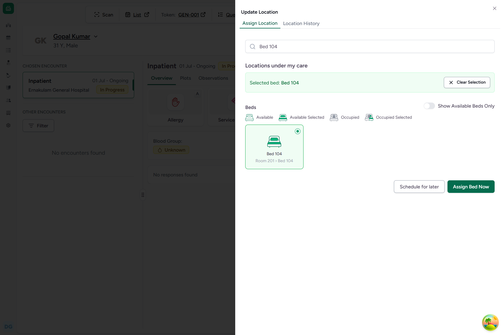
*Figure 20.1: Location Selector Dialog indicating Bed 105*

*Figure 20.2: Bed Assigned successfully to active encounter*

### Backend Technical Flow & Database Mapping
* **Django Models**: `Encounter`, `FacilityLocationEncounter` (located in [location.py](file:///c:/Projects/HealthcareSystems/care/care/emr/models/location.py))
* **Database Tables**: `emr_encounter` (cached location updated), `emr_facilitylocationencounter`
* **Fields Written (FacilityLocationEncounter)**:
  * `status`: `"reserved"` (assigned but not yet transferred)
  * `location_id`: `13` (Bed 105)
  * `encounter_id`: `[Encounter ID]`
  * `start_datetime`: Current timestamp

---

## FLOW-21: Transferring Patient to Bed

### Objective
Complete the patient physical transfer, updating the Bed status from Reserved to Active.

### Step-by-Step UI Process
1. On the location widget of the encounter page, locate `Bed 105` listed as Reserved.
2. Click **Transfer** or **Update Status**.
3. In the status dropdown, choose **Active**.
4. Click **Submit** to finalize the location transfer. The location badge will update to **Active**.

### Screenshots
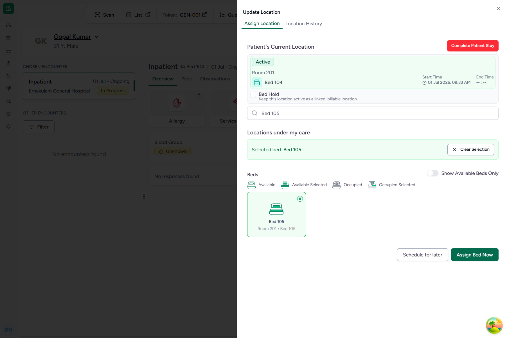
*Figure 21.1: Complete Location Transfer dialog*

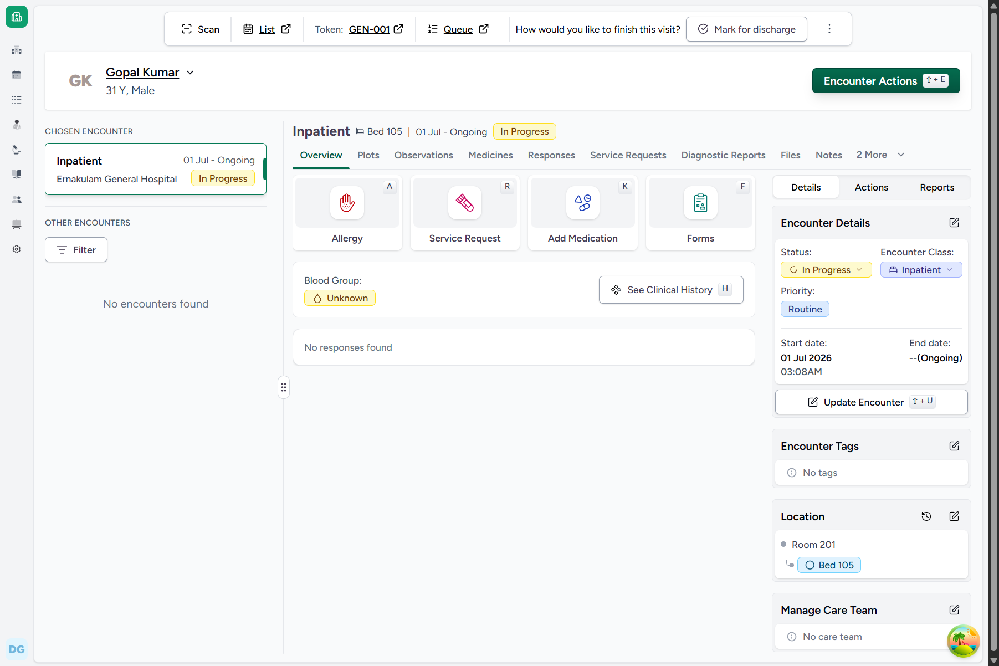
*Figure 21.2: Location Status updated to Active on encounter overview*

### Backend Technical Flow & Database Mapping
* **Django Model**: `FacilityLocationEncounter`
* **Database Table**: `emr_facilitylocationencounter`
* **State Changes**:
  * `status`: Updated from `"reserved"` to `"active"`
  * `emr_encounter.current_location_id`: Updated to `13` (Bed 105)

---

## FLOW-22: Recording Clinical Vitals

### Objective
Record key physical observations (Temperature, Heart Rate, Respiratory Rate, BP, SpO2) for the patient.

### Step-by-Step UI Process
1. From the Encounter updates page, click **Encounter Actions** (or `⇧ + E`) and select **Observations**.
2. Click **Log Vitals** or select **Vitals Form**.
3. Input the vitals:
   * **Body Temperature**: `98.6` F
   * **Heart Rate**: `72` bpm
   * **Respiratory Rate**: `16` breaths/min
   * **Systolic BP**: `120` mmHg
   * **Diastolic BP**: `80` mmHg
   * **SpO2**: `98` %
4. Click **Submit** to record the vitals.

### Screenshots
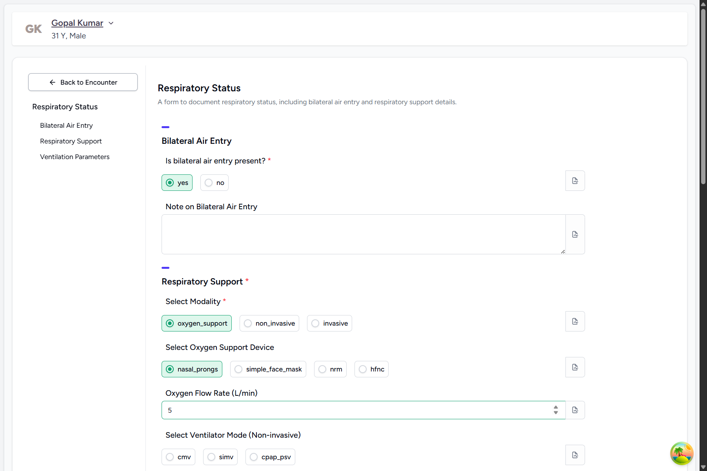
*Figure 22.1: Clinical Vitals entry form*

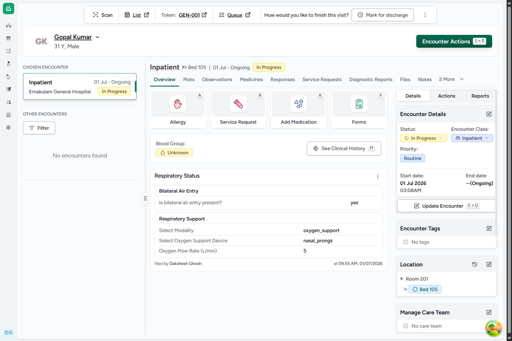
*Figure 22.2: Logged vitals visible on encounter dashboard*

### Backend Technical Flow & Database Mapping
* **Django Model**: `Observation` (located in [observation.py](file:///c:/Projects/HealthcareSystems/care/care/emr/models/observation.py))
* **Database Table**: `emr_observation`
* **Fields Written**:
  * `encounter_id`: `[Encounter ID]`
  * `patient_id`: `[Gopal Kumar ID]`
  * `value`: `{"temperature": 98.6, "heart_rate": 72, "systolic_bp": 120, "diastolic_bp": 80, "spo2": 98, "respiratory_rate": 16}`
  * `status`: `"final"`

---

## FLOW-23: Recording Symptoms

### Objective
Record presenting clinical symptoms (Fever, cough, body pain) and specify severity.

### Step-by-Step UI Process
1. On the encounter page, click **Encounter Actions** -> **Add Symptom\nS**.
2. In the symptom questionnaire form:
   * **Symptom**: Search and click **Fever**.
   * **Severity**: Select **Moderate**.
   * **Clinical Status**: Select **Active**.
   * **Verification Status**: Select **Confirmed**.
3. Click **Submit** to register the symptom.

### Screenshots
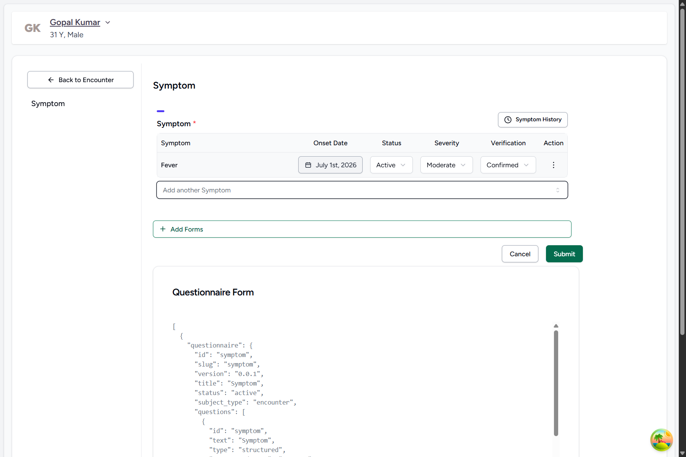
*Figure 23.1: Symptom entry form specifying Fever*

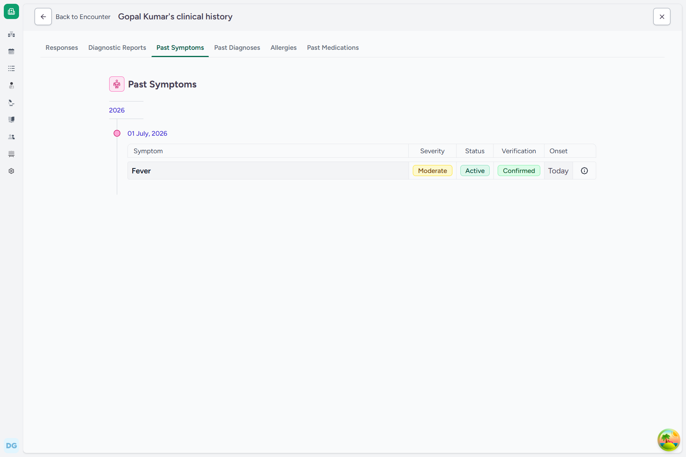
*Figure 23.2: Active symptoms list on Overview*

### Backend Technical Flow & Database Mapping
* **Django Model**: `Condition` (located in [condition.py](file:///c:/Projects/HealthcareSystems/care/care/emr/models/condition.py))
* **Database Table**: `emr_condition`
* **Fields Written**:
  * `patient_id`: `[Gopal Kumar ID]`
  * `encounter_id`: `[Encounter ID]`
  * `code`: `{"code": "386661006", "display": "Fever", "system": "http://snomed.info/sct"}`
  * `severity`: `"moderate"`
  * `clinical_status`: `"active"`
  * `verification_status`: `"confirmed"`

---

## FLOW-29: Discharging Patient

### Objective
Process clinical discharge for the patient, record discharge summary advice, and release the physical bed asset.

### Step-by-Step UI Process
1. Navigate to the encounter dashboard for **Gopal Kumar**.
2. Under "How would you like to finish this visit?", click **Mark for discharge**.
3. In the discharge form:
   * **Discharge Summary Advice**: Enter `"Rest at home and take paracetamol as prescribed."`
   * **Discharge Disposition**: Select **Home**.
4. Click **Submit** to complete the discharge. The encounter state changes to **Discharged**.

### Screenshots
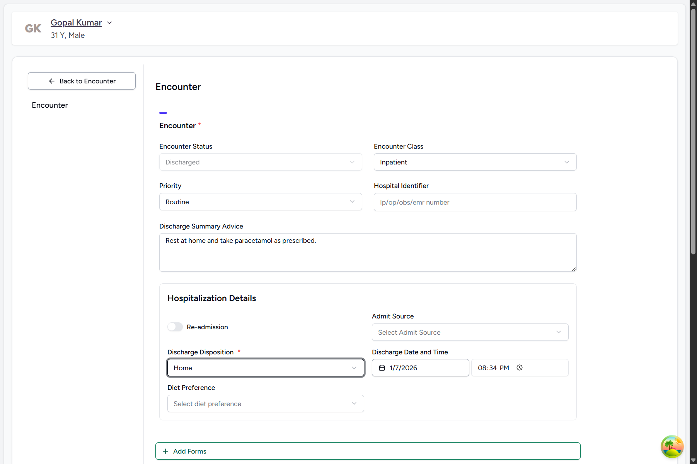
*Figure 29.1: Discharge configuration form*

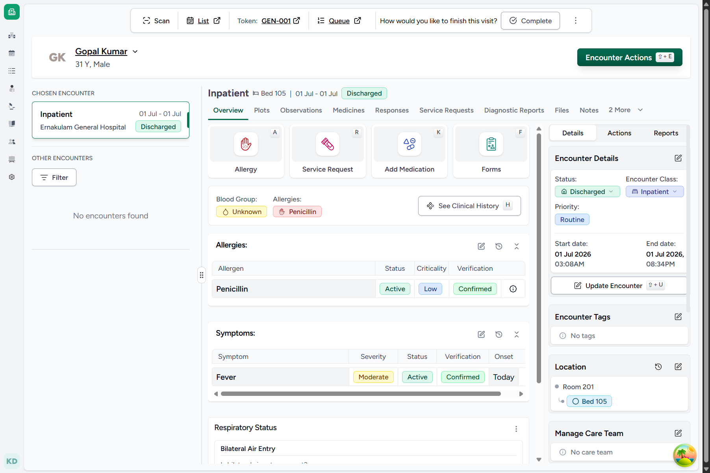
*Figure 29.2: Discharged encounter status showing release*

### Backend Technical Flow & Database Mapping
* **Django Model**: `Encounter`, `FacilityLocationEncounter`
* **Database Tables**: `emr_encounter`, `emr_facilitylocationencounter`
* **Fields Written & State Changes**:
  * `emr_encounter.status`: Updated to `"discharged"`
  * `emr_encounter.discharge_summary_advice`: `"Rest at home and take paracetamol as prescribed."`
  * `emr_encounter.hospitalization`: `{"discharge_disposition": "home"}`
  * `emr_facilitylocationencounter.end_datetime`: Set to current timestamp (releasing the bed `Bed 105`)
