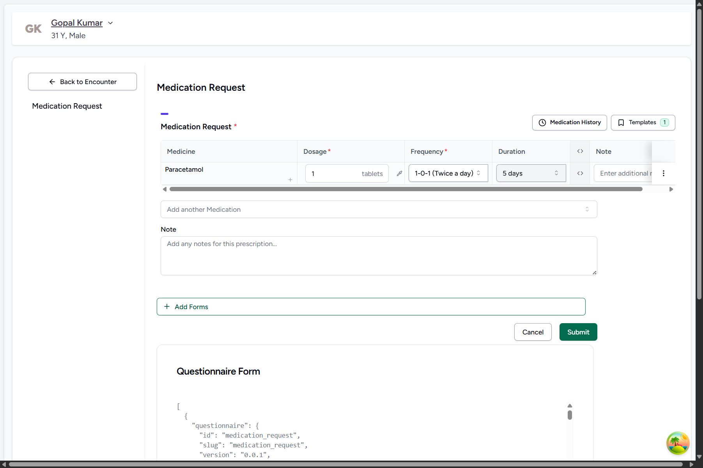
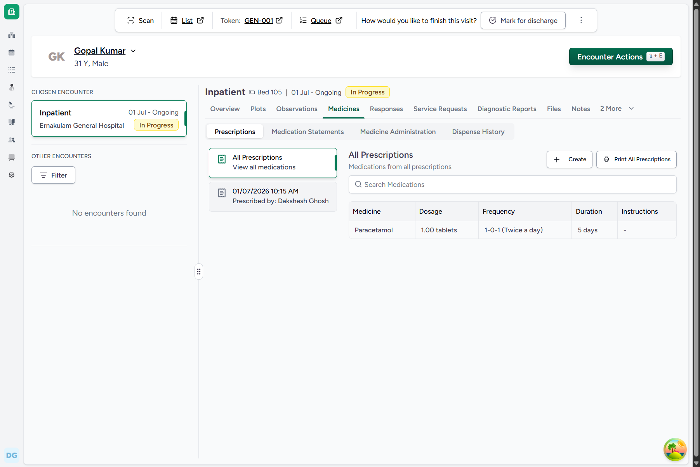
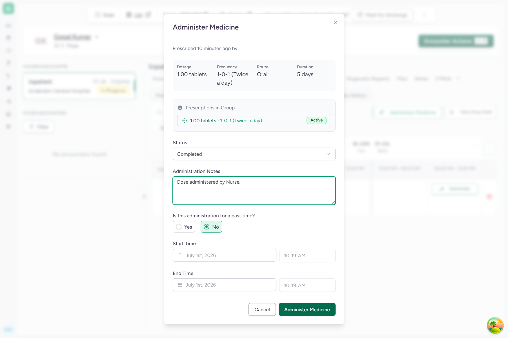
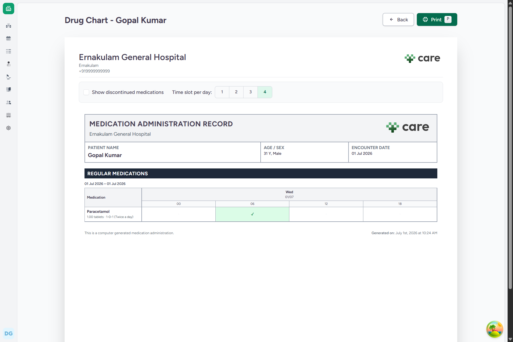
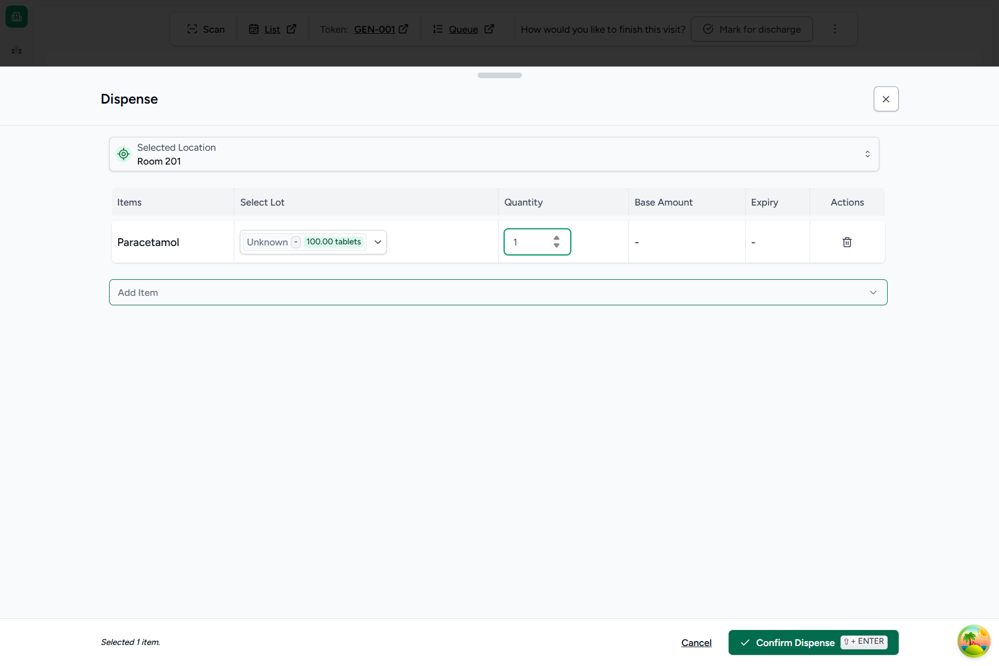
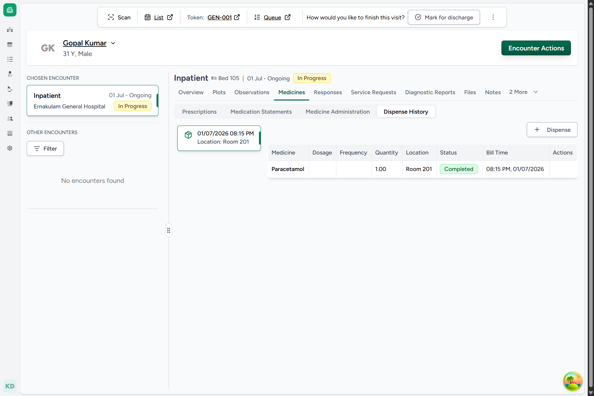
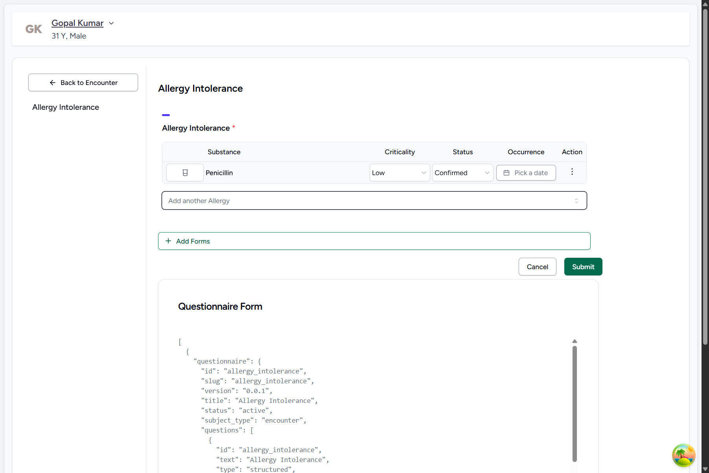
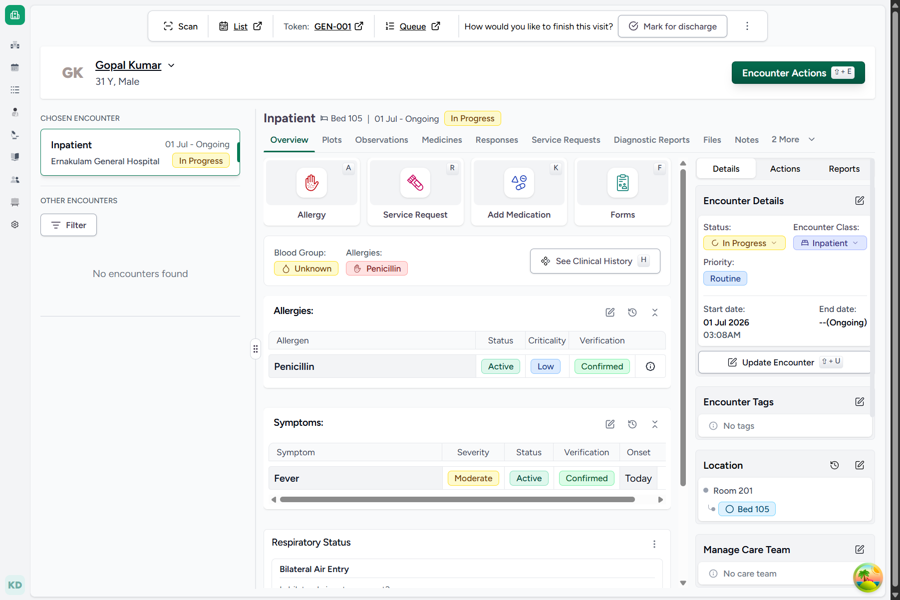
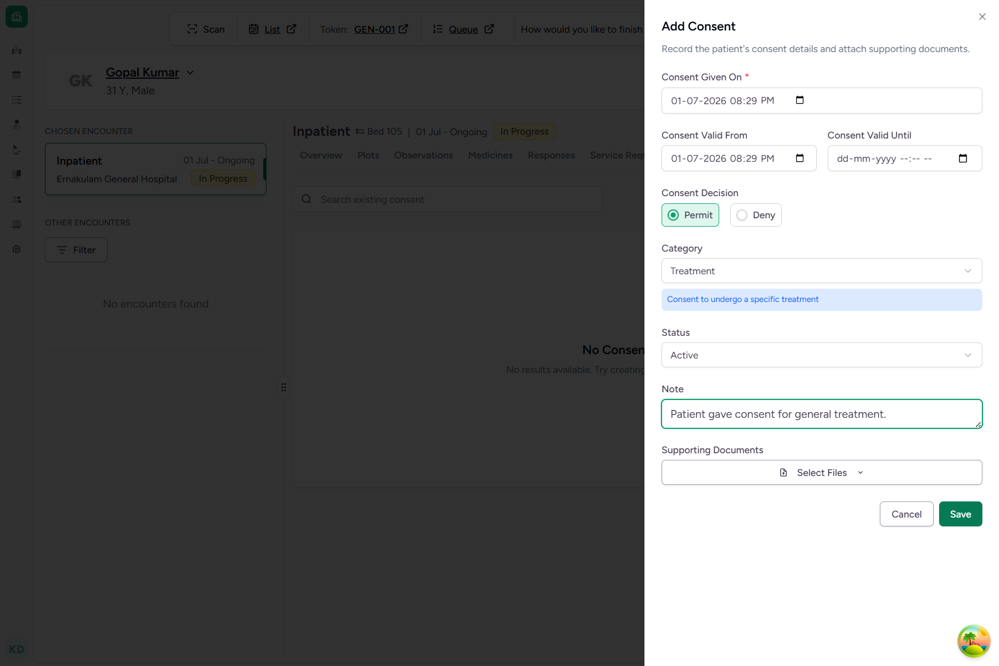
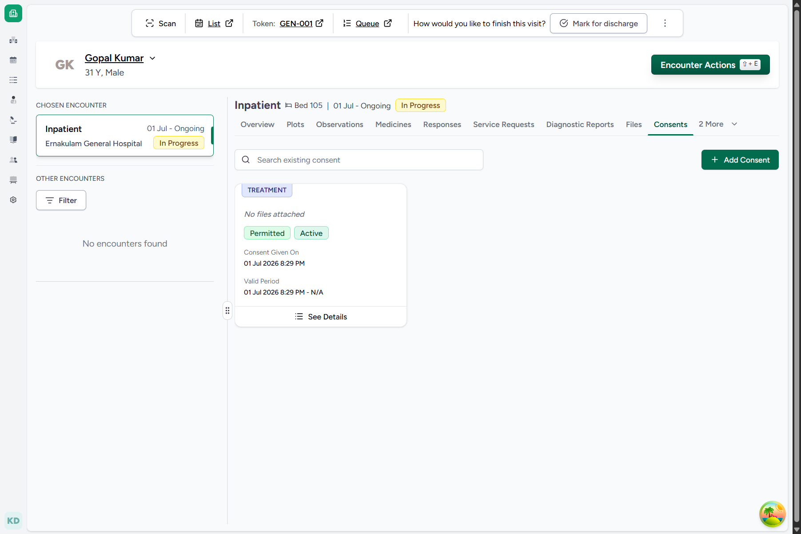

# Domain F: Medication, Allergy, & Consent Lifecycle

CARE EMR manages complex clinical lifecycle events including drug prescriptions, medication administration logs, location-based medication dispensing, patient allergies, and legal treatment consents. This document details the step-by-step processes to execute and verify these lifecycles.

---

## Default Practitioner Credentials
For all clinical workflows below, authenticate using the practitioner credentials:
* **Login URL**: `http://localhost:4000/`
* **Username**: `dr_kochitest`
* **Password**: `Ohcn@123`

---

## FLOW-24: Prescribing Medication

### Objective
Prescribe a regular oral medication (`Paracetamol`, `1 tablet`, `1-0-1`, `5 days`) for `Gopal Kumar` on his active Inpatient encounter.

### Step-by-Step UI Process
1. Navigate to the active Inpatient encounter dashboard for **Gopal Kumar** (or login as `dr_kochitest`).
2. Click **Encounter Actions ⇧ + E** and select **Add Medication\nK**.
3. In the Medication Request form:
   * Click the **Add Medication** search bar. Search for `"Paracetamol"` and click the SNOMED product **Paracetamol**.
   * **Dosage**: Enter `1` tablet.
   * **Frequency**: Select **1-0-1 (Twice a day)**.
   * **Duration**: Select **5 days**.
4. Click **Submit** to finalize the prescription.
5. In the **Medicines** tab, verify that `Paracetamol` is listed under regular prescriptions.

### Screenshots

*Figure 24.1: Prescription Form specifying drug and dosage frequency*

*Figure 24.2: Medication listed under regular prescriptions*

### Backend Technical Flow & Database Mapping
* **Django Model**: `MedicationRequest` (located in [medication_request.py](file:///c:/Projects/HealthcareSystems/care/care/emr/models/medication_request.py))
* **Database Table**: `emr_medicationrequest`
* **Fields Written**:
  * `id`: `UUID` (Generated automatically)
  * `patient_id`: `[Gopal Kumar ID]`
  * `encounter_id`: `[Encounter ID]`
  * `status`: `"active"`
  * `requested_product_id`: `2` (Paracetamol ProductKnowledge)
  * `dosage_instruction`: Contains details about frequency (`1-0-1`) and duration (`5 days`).

---

## FLOW-25: Recording Medication Administration

### Objective
Record a medication administration dose event (confirming the nurse administered a Paracetamol dose).

### Step-by-Step UI Process
1. Navigate to the **Medicines** tab of the active encounter page.
2. Select the sub-tab **Medicine Administration**.
3. Under the regular medications list, locate `Paracetamol` and click the **Administer** button next to it.
4. In the Administer Medicine dialog:
   * **Status**: Select **Completed**.
   * **Administration Notes**: Enter `"Dose administered by Nurse."`
   * **Is this administration for a past time?**: Select **No** (Defaults to current date/time).
5. Click **Administer Medicine** to save the record.
6. Click **View Drug Chart** link to check the computer-generated drug chart. Verify that a green checkmark `✓` is marked on the current time slot.

### Screenshots

*Figure 25.1: Medication Administration confirmation dialog*

*Figure 25.2: Printable Drug Chart showing successful administration*

### Backend Technical Flow & Database Mapping
* **Django Model**: `MedicationAdministration` (located in [medication_administration.py](file:///c:/Projects/HealthcareSystems/care/care/emr/models/medication_administration.py))
* **Database Table**: `emr_medicationadministration`
* **Fields Written**:
  * `id`: `UUID` (Generated automatically)
  * `request_id`: `[MedicationRequest ID]`
  * `status`: `"completed"`
  * `note`: `"Dose administered by Nurse."`
  * `effective_datetime`: Current timestamp

---

## FLOW-26: Dispensing Medication

### Objective
Dispense the prescribed medication from facility stock location (`Room 201`) to the patient, updating stock level inventory.

### Step-by-Step UI Process
1. Navigate to the active encounter medicines page.
2. Click **Encounter Actions** (or `⇧ + E`) -> **Dispense\n⇧ + D**.
3. In the Location Switcher dialog:
   * Click **Room 201** -> **Select ⇧ + ENTER**.
4. In the Dispense drawer form:
   * Click the **Add Item** combobox. Search `"Paracetamol"` and select it.
   * Select the available lot (`Unknown - 100.00 tablets`).
   * **Quantity**: Enter `1`.
5. Click **Confirm Dispense ⇧ + ENTER** to submit the dispense record.
6. Under the **Dispense History** sub-tab, verify that `Paracetamol` is listed with status **Completed**.

### Screenshots

*Figure 26.1: Dispense Drawer showing item selection and stock quantity*

*Figure 26.2: Completed Dispense History table*

### Backend Technical Flow & Database Mapping
* **Django Models**: `MedicationDispense`, `InventoryItem` (located in [medication_dispense.py](file:///c:/Projects/HealthcareSystems/care/care/emr/models/medication_dispense.py) and [inventory_item.py](file:///c:/Projects/HealthcareSystems/care/care/emr/models/inventory_item.py))
* **Database Tables**: `emr_medicationdispense`, `emr_inventoryitem`
* **State Changes & Inventory Update**:
  * `emr_medicationdispense.status`: `"completed"`
  * `emr_inventoryitem.net_content`: Decremented by `1.000000` (e.g. from `100.000000` to `99.000000`) for the location `11` (Room 201) and product `5` (Paracetamol).

---

## FLOW-27: Recording Patient Allergy

### Objective
Record a drug-class allergy (`Penicillin`) for `Gopal Kumar` with `Low` criticality and status `Confirmed`.

### Step-by-Step UI Process
1. On the active encounter updates page, click **Encounter Actions** -> **Add Allergy\nA**.
2. In the Allergy Intolerance form:
   * Click the **Add Allergy** combobox. Search `"Penicillin"` and select the SNOMED code **Penicillin**.
   * **Category**: Select **Medication allergy**.
   * **Criticality**: Select **Low**.
   * **Status**: Select **Confirmed**.
3. Click **Submit** to record the allergy.
4. On the encounter overview dashboard, verify that **Penicillin** is listed under the **Allergies** section with active status.

### Screenshots

*Figure 27.1: Allergy Intolerance entry form*

*Figure 27.2: Active Allergy listed on encounter dashboard overview*

### Backend Technical Flow & Database Mapping
* **Django Model**: `AllergyIntolerance` (located in [allergy_intolerance.py](file:///c:/Projects/HealthcareSystems/care/care/emr/models/allergy_intolerance.py))
* **Database Table**: `emr_allergyintolerance`
* **Fields Written**:
  * `patient_id`: `[Gopal Kumar ID]`
  * `encounter_id`: `[Encounter ID]`
  * `code`: `{"code": "764146007", "display": "Penicillin", "system": "http://snomed.info/sct"}`
  * `criticality`: `"low"`
  * `clinical_status`: `"active"`
  * `verification_status`: `"confirmed"`
  * `allergy_intolerance_type`: `"allergy"`

---

## FLOW-28: Logging Patient Consent

### Objective
Record and log patient legal consent (`Treatment` category, `Permit` decision, `Active` status) for Inpatient hospitalization.

### Step-by-Step UI Process
1. On the active encounter updates page, click **Encounter Actions** -> **Manage Consents\nG + C**.
2. On the Consents workspace page, click the **Add Consent** button.
3. In the Add Consent form:
   * **Consent Given On / Valid From**: Defaults to current date/time.
   * **Consent Decision**: Select **Permit**.
   * **Category**: Select **Treatment**.
   * **Status**: Select **Active**.
   * **Note**: Enter `"Patient gave consent for general treatment."`
4. Click **Save** to finalize.
5. Verify that the consent is listed under the **Consents** history board with decision **Permitted**.

### Screenshots

*Figure 28.1: Add Consent dialog configuration*

*Figure 28.2: Active Consent record in Consents History list*

### Backend Technical Flow & Database Mapping
* **Django Model**: `Consent` (located in [consent.py](file:///c:/Projects/HealthcareSystems/care/care/emr/models/consent.py))
* **Database Table**: `emr_consent`
* **Fields Written**:
  * `encounter_id`: `[Encounter ID]`
  * `category`: `"treatment"`
  * `decision`: `"permit"`
  * `status`: `"active"`
  * `date`: Current timestamp
  * `note`: `"Patient gave consent for general treatment."`
