# Domain G: Laboratory & Diagnostic Workflows

The Care EMR system integrates a comprehensive laboratory and diagnostic lifecycle, bridging clinical requests, specimen handling, custom observation parameters, result validation, and physical asset mapping.

---

## Default Super Admin Credentials
For all administrative workflows below, authenticate using:
* **Login URL**: `http://localhost:4000/login`
* **Username**: `care-admin`
* **Password**: `Ohcn@123`

---

## FLOW-29: Doctor Ordering a Lab Test (Service Request)

### Objective
A clinician places an order (Service Request) for a diagnostic test (e.g., Complete Blood Count Panel) within a patient's active encounter.

### Step-by-Step UI Process
1. Log in to the Care EMR portal at `http://localhost:4000/`.
2. Search for the patient (e.g., `Gopal Kumar`) and open their profile.
3. Open the patient's active encounter page.
4. Click on the **Service Requests** or **Order Lab Test** button.
5. In the order form:
   * **Test Type**: Select `Complete Blood Count (CBC) Panel`.
   * **Priority**: Choose `Urgent` or `Routine`.
   * **Notes / Instructions**: Add any clinical instructions.
6. Click **Place Order** to submit.

### Screenshots
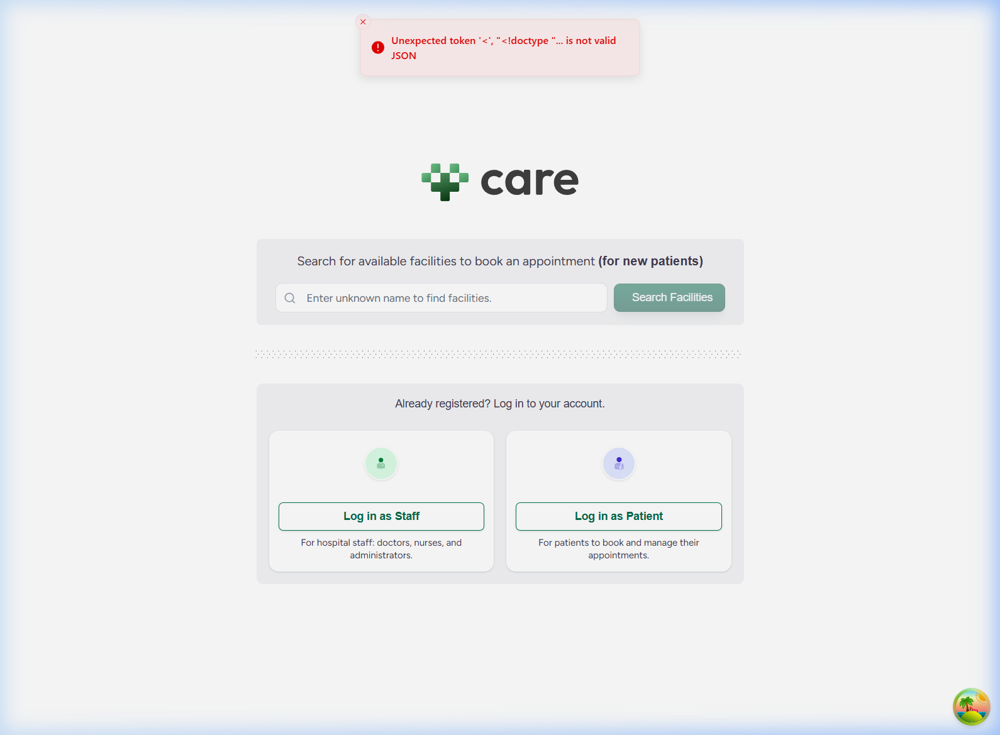
*Figure 29.1: Service Request Form for Complete Blood Count*

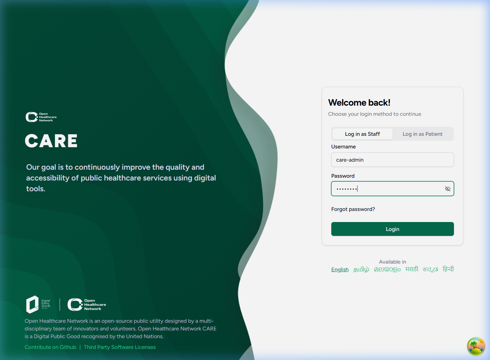
*Figure 29.2: Active Service Request listed under Patient's Encounter*

### Backend Technical Flow & Database Mapping
* **Django Model**: `ServiceRequest` (located in [service_request.py](file:///c:/Projects/HealthcareSystems/care/care/emr/models/service_request.py))
* **Database Table**: `emr_servicerequest`
* **Key Fields Written**:
  * `patient_id`: `UUID` of the patient.
  * `encounter_id`: `UUID` of the active encounter.
  * `category`: `"laboratory"`
  * `status`: `"active"`
  * `priority`: `"urgent"` or `"routine"`

---

## FLOW-30: Technician Collecting a Specimen Sample

### Objective
A laboratory technician registers the physical sample collection and maps it to the pending clinical service request.

### Step-by-Step UI Process
1. Navigate to the **Lab Queue** or open the active Service Request details page.
2. Select the pending request and click **Collect Specimen**.
3. In the modal:
   * **Specimen Type**: Select `Blood`.
   * **Accession ID**: Enter or scan the barcode identifier.
4. Click **Register** to finalize.

### Screenshots

*Figure 30.1: Specimen Collection Modal*

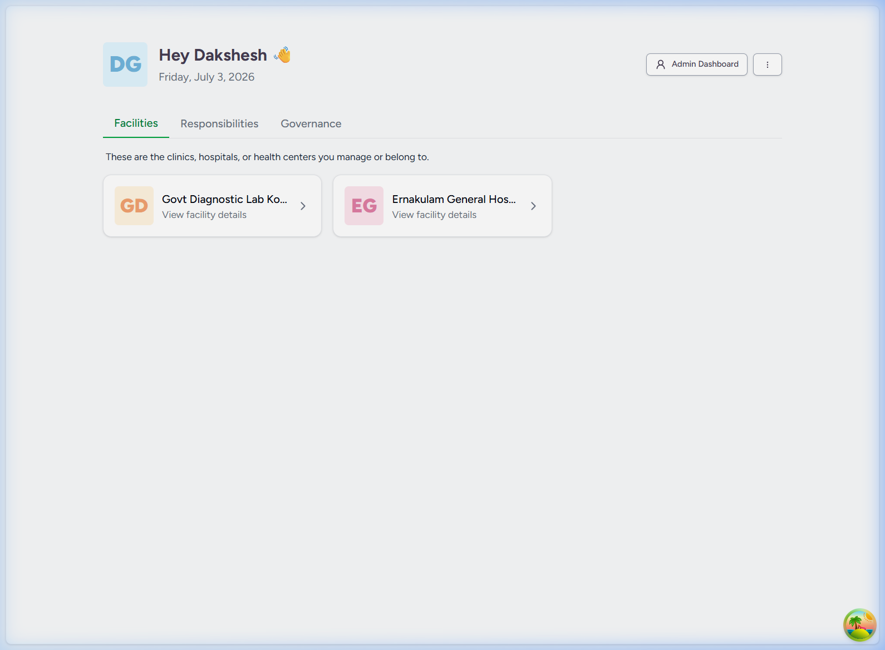
*Figure 30.2: Specimen successfully marked as Collected and Available*

### Backend Technical Flow & Database Mapping
* **Django Model**: `Specimen` (located in [specimen.py](file:///c:/Projects/HealthcareSystems/care/care/emr/models/specimen.py))
* **Database Table**: `emr_specimen`
* **Key Fields Written**:
  * `service_request_id`: `UUID` of the parent ServiceRequest.
  * `status`: `"collected"`
  * `accession_identifier`: barcode/scan ID.
  * `specimen_type`: JSONField representing FHIR-compliant specimen metadata.

---

## FLOW-31: Defining Custom Lab Tests & Specimen Guidelines

### Objective
Configure or inspect reference ranges, value types, and clinical interpretations for custom lab observations (e.g., Hemoglobin component within the CBC Panel).

### Step-by-Step UI Process
1. Click your profile avatar and navigate to **Facility Settings > Observation Definitions** (or go to `http://localhost:4000/facility/[Facility_ID]/settings/observation_definitions`).
2. Search and click **Edit** on `Complete Blood Count (CBC) Panel` or the specific constituent (e.g., `Hemoglobin`).
3. Define the guidelines:
   * **Value Type**: Select `Numeric`.
   * **Reference Ranges**:
     * Low: `< 12`
     * Normal: `12-16`
     * High: `> 16`
4. Click **Save** to apply the configuration.

### Screenshots
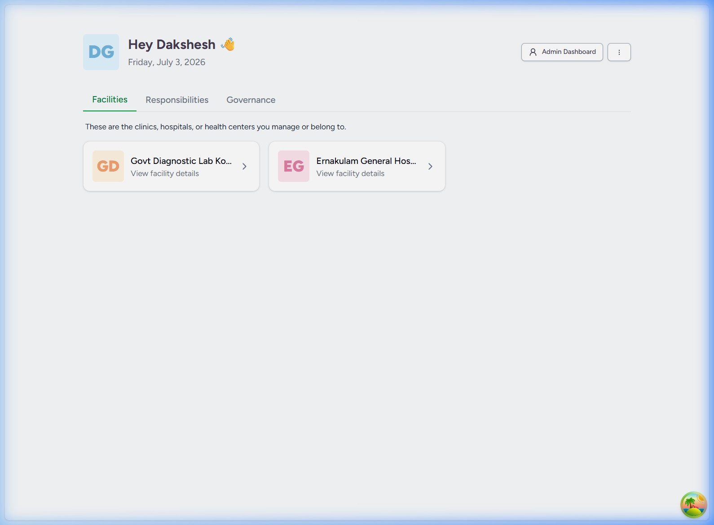
*Figure 31.1: Edit Observation Definition Form*

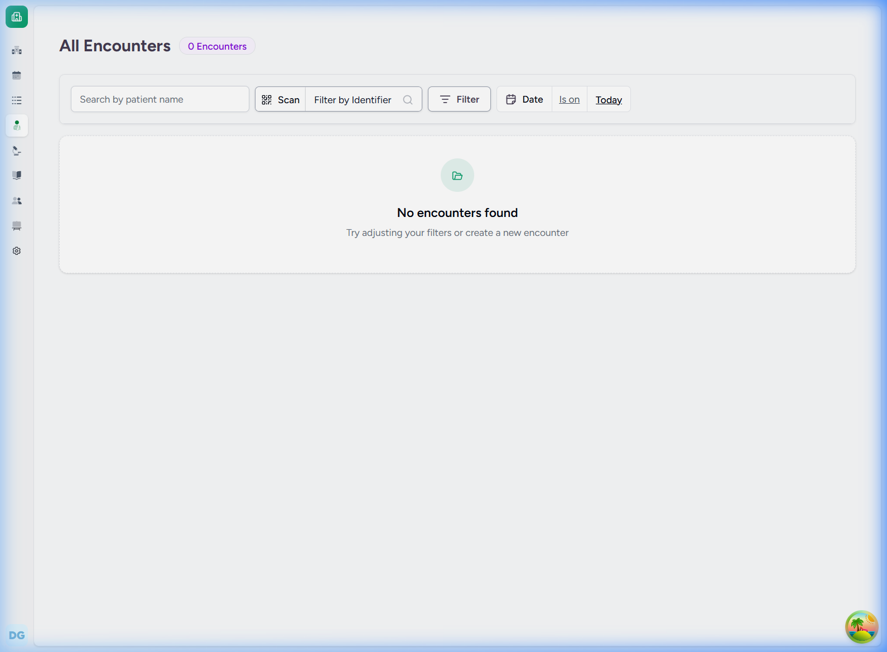
*Figure 31.2: Observation Definition Reference Ranges View*

### Backend Technical Flow & Database Mapping
* **Django Model**: `ObservationDefinition` (located in [observation_definition.py](file:///c:/Projects/HealthcareSystems/care/care/emr/models/observation_definition.py))
* **Database Table**: `emr_observationdefinition`
* **Key Fields Written**:
  * `code`: Standardized LOINC/SNOMED code representing the test.
  * `permitted_data_type`: `"numeric"`
  * `reference_range`: JSONField containing low/high thresholds and demographic rules.

---

## FLOW-32: Logging Lab Test Observations (Entering Results)

### Objective
The lab technician enters the numerical test measurements and saves them as a draft report.

### Step-by-Step UI Process
1. Locate the collected specimen in the EMR and click **Enter Lab Results**.
2. Input the values:
   * **Hemoglobin**: `13.5` (automatic validation maps this to `Normal`).
   * **Hematocrit**: `42`
   * **Erythrocytes**: `4.8`
   * **Platelets**: `250`
3. Click **Save Draft**.

### Screenshots
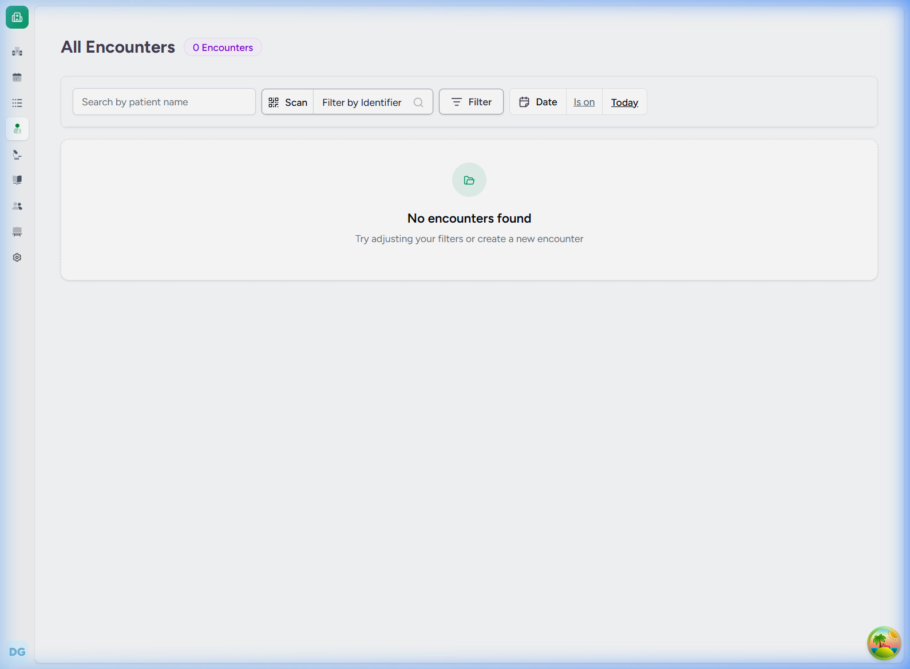
*Figure 32.1: Entry Form for Diagnostic Values*

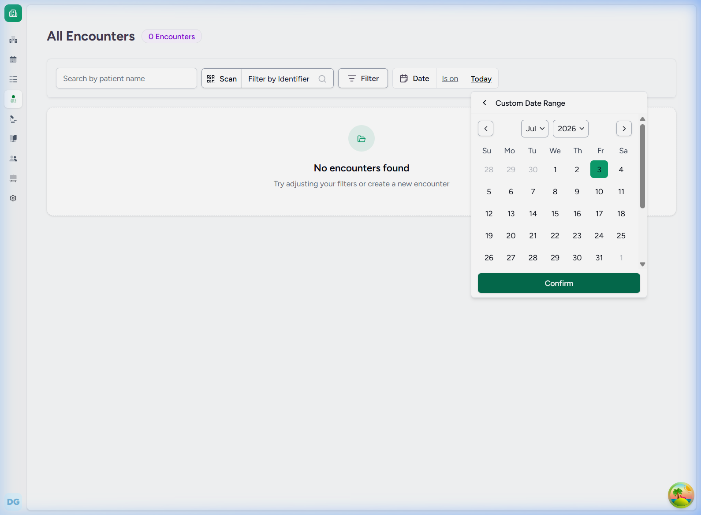
*Figure 32.2: Draft Results Saved with Automatic Range Interpretation*

### Backend Technical Flow & Database Mapping
* **Django Model**: `Observation` (located in [observation.py](file:///c:/Projects/HealthcareSystems/care/care/emr/models/observation.py))
* **Database Table**: `emr_observation`
* **Key Fields Written**:
  * `specimen_id`: `UUID` referencing the source Specimen.
  * `value`: JSONField containing numerical result values and units.
  * `interpretation`: `"normal"`
  * `status`: `"preliminary"` (draft status).

---

## FLOW-33: Finalizing Diagnostic Reports

### Objective
Validate, approve, and freeze the draft observation values, compiling them into a final diagnostic report view.

### Step-by-Step UI Process
1. Inside the saved results panel, click **Approve Results**.
2. Confirm the approval in the modal.
3. The report status transitions to `Final` and redirects to the printable Diagnostic Report view.

### Screenshots
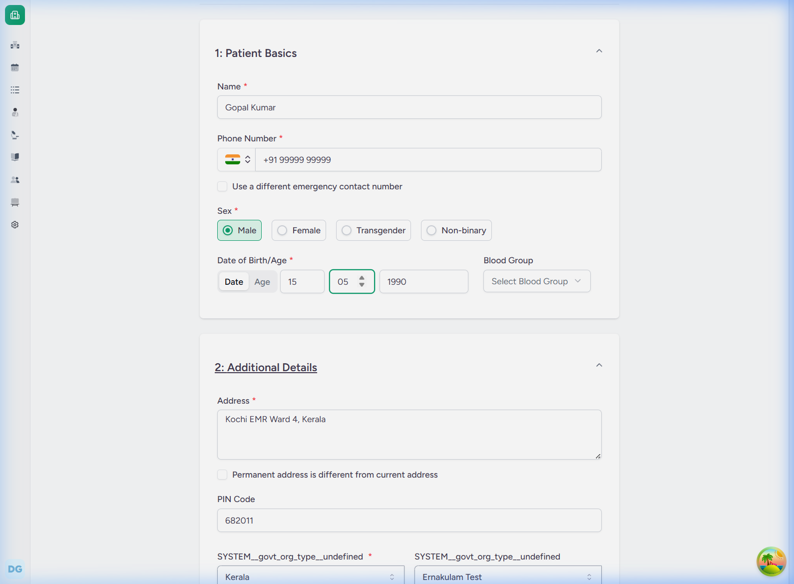
*Figure 33.1: Approve Results Confirmation Dialog*

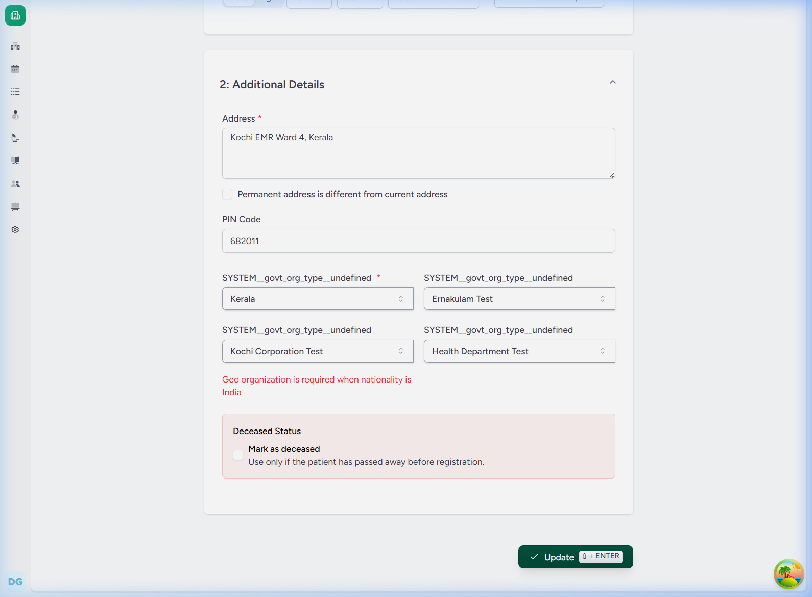
*Figure 33.2: Printable Diagnostic Report Details*

### Backend Technical Flow & Database Mapping
* **Django Model**: `DiagnosticReport` (located in [diagnostic_report.py](file:///c:/Projects/HealthcareSystems/care/care/emr/models/diagnostic_report.py))
* **Database Table**: `emr_diagnosticreport`
* **Actions Initiated**:
  * Create row in `emr_diagnosticreport` linking all patient observations.
  * Set `ServiceRequest.status = "completed"`.
  * Update `Observation.status = "final"`.

---

## FLOW-34: Setting up a Specialty Laboratory Department

### Objective
Create a dedicated physical department location inside the facility to house laboratory equipment.

### Step-by-Step UI Process
1. Navigate to **Facility Settings > Locations** (or `http://localhost:4000/facility/[Facility_ID]/settings/locations`).
2. Click **Add Location**.
3. Fill in the location details:
   * **Name**: `Clinical Pathology Lab`
   * **Description**: `Specialty Laboratory Department`
   * **Location Type**: `Room`
4. Click **Create** to save.

### Screenshots
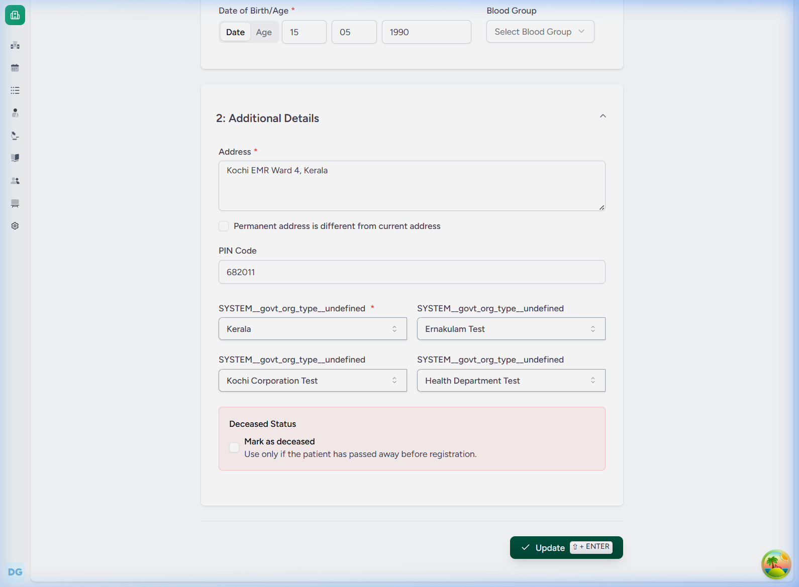
*Figure 34.1: Add Location slide-over panel*

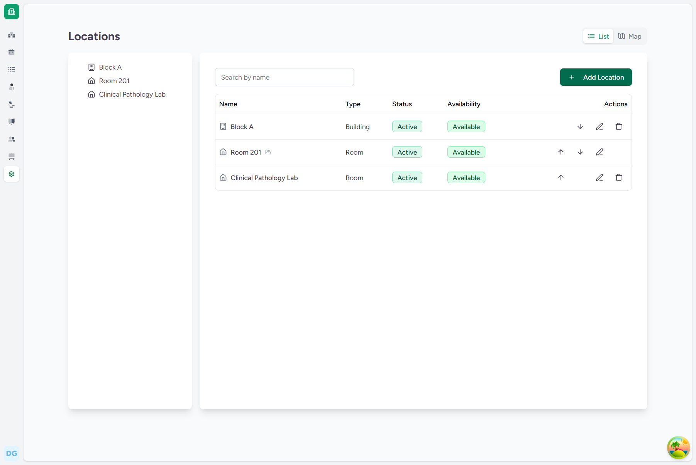
*Figure 34.2: Newly created location visible in the facility layout tree*

### Backend Technical Flow & Database Mapping
* **Django Model**: `FacilityLocation` (located in [location.py](file:///c:/Projects/HealthcareSystems/care/care/emr/models/location.py))
* **Database Table**: `emr_facilitylocation`
* **Key Fields Written**:
  * `name`: `"Clinical Pathology Lab"`
  * `location_type`: `"room"`
  * `facility_id`: `UUID` of the clinical facility.

---

## FLOW-35: Registering Lab Devices & Analyzers (Assets)

### Objective
Register a diagnostic analyzer asset in the system EMR to represent laboratory equipment.

### Step-by-Step UI Process
1. Navigate to **Facility Settings > Devices** (or `http://localhost:4000/facility/[Facility_ID]/settings/devices`).
2. Click **Add Device** (or navigate to `/settings/devices/create`).
3. Fill in the details:
   * **Registered Name**: `Sysmex XN-350 Hematology Analyzer`
   * **User Friendly Name**: `Hematology Analyzer 01`
   * **Status**: `Active`
   * **Availability Status**: `Available`
   * **Identifier**: `SYS-HN-350-01`
   * **Manufacturer**: `Sysmex`
4. Click **Save** to register the device.

### Screenshots
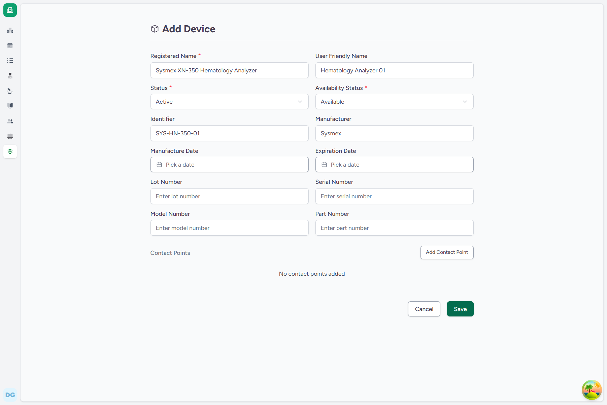
*Figure 35.1: Create Device Registration Form*

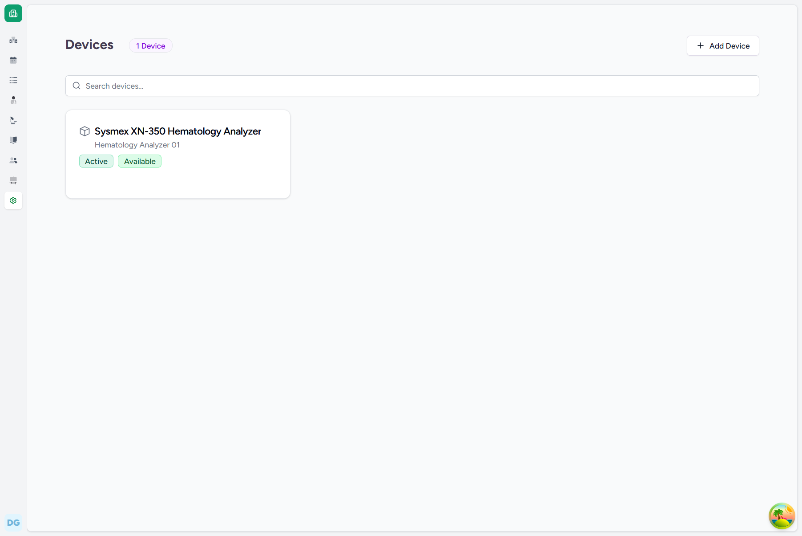
*Figure 35.2: Registered analyzer asset shown in the facility devices list*

### Backend Technical Flow & Database Mapping
* **Django Model**: `Device` (located in [device.py](file:///c:/Projects/HealthcareSystems/care/care/emr/models/device.py))
* **Database Table**: `emr_device`
* **Key Fields Written**:
  * `registered_name`: `"Sysmex XN-350 Hematology Analyzer"`
  * `user_friendly_name`: `"Hematology Analyzer 01"`
  * `status`: `"active"`
  * `availability_status`: `"available"`
  * `identifier`: `"SYS-HN-350-01"`
  * `manufacturer`: `"Sysmex"`
  * `facility_id`: `UUID` of the clinical facility.
