# Domain H: Inventory & Asset Management

The Care EMR system provides a comprehensive module for managing clinical and non-clinical assets, tracking device maintenance histories, creating purchase requests, and receiving external stock deliveries to update inventory counts.

---

## Default Super Admin Credentials
For all administrative workflows below, authenticate using:
* **Login URL**: `http://localhost:4000/login`
* **Username**: `care-admin`
* **Password**: `Ohcn@123`

---

## FLOW-36: Registering an Asset in a Facility

### Objective
Register a new physical hardware asset (e.g., ICU Ventilator) under a facility to track its status, location, and metadata.

### Step-by-Step UI Process
1. Log in to the Care EMR portal.
2. Select the facility (e.g., `Kochi Test Hospital`).
3. Click on the gear icon (Settings) in the sidebar and navigate to **Devices** (`/settings/devices`).
4. Click the **+ Add Device** button.
5. In the device registration form:
   * **Registered Name**: Enter `ICU Ventilator #4`.
   * **User Friendly Name**: Enter `Ventilator 04`.
   * **Identifier**: Enter `VENT-ICU-04`.
   * **Manufacturer**: Enter `Philips`.
   * **Status**: Select `Active`.
   * **Availability Status**: Select `Available`.
6. Click **Save** to submit.

### Screenshots
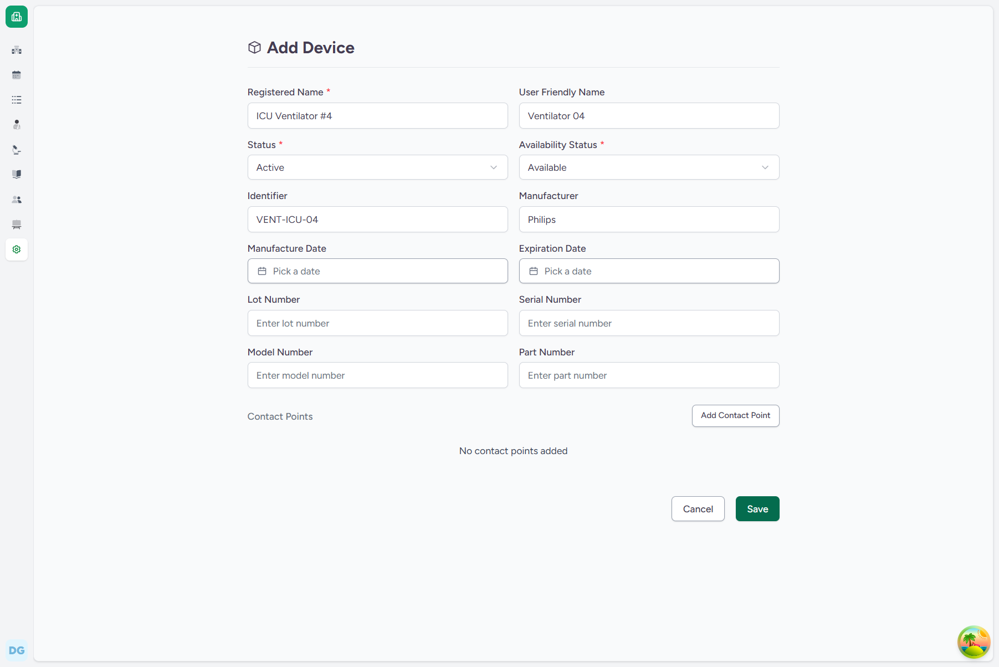
*Figure 36.1: Asset registration form for ICU Ventilator #4*

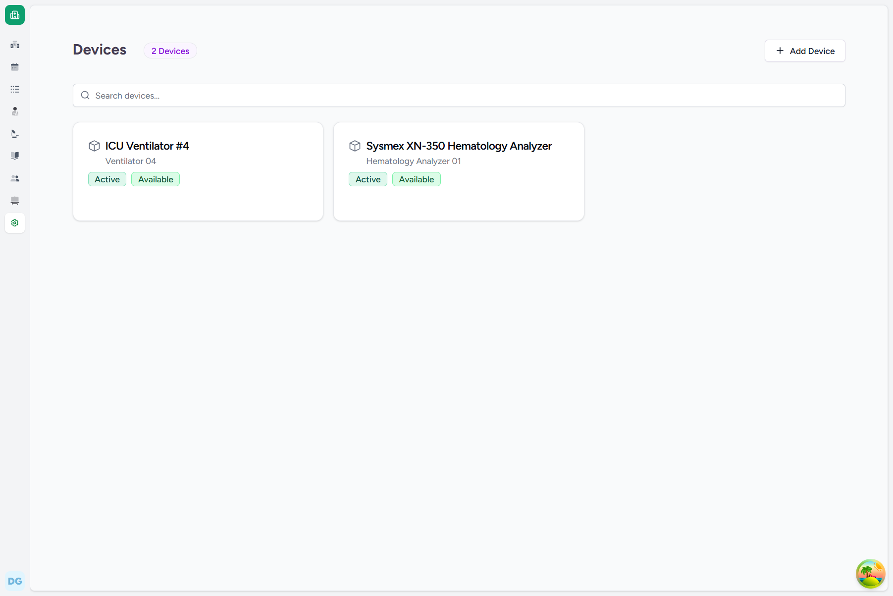
*Figure 36.2: Newly registered asset shown in the facility's Devices list*

### Backend Technical Flow & Database Mapping
* **Django Model**: `Device` (located in [device.py](file:///c:/Projects/HealthcareSystems/care/care/emr/models/device.py))
* **Database Table**: `emr_device`
* **Key Fields Written**:
  * `registered_name`: `"ICU Ventilator #4"`
  * `user_friendly_name`: `"Ventilator 04"`
  * `identifier`: `"VENT-ICU-04"`
  * `manufacturer`: `"Philips"`
  * `status`: `"active"`
  * `availability_status`: `"available"`
  * `facility_id`: `UUID` of the current facility.

---

## FLOW-37: Tracking Asset Maintenance & Downtime Logs

### Objective
Log maintenance activities or downtime details for registered assets to maintain audit trails.

### Step-by-Step UI Process
1. From the facility's **Devices** list settings page, click on the **ICU Ventilator #4** card.
2. Under the **Service History** section of the device details page, click the **+ Add Service Record** button.
3. In the side panel:
   * **Notes**: Enter the maintenance description (e.g., `Periodic maintenance - replaced oxygen sensors, calibrated flow meters, and verified backup battery status. Machine is currently down for testing.`).
4. Click **Save** to commit the record.

### Screenshots
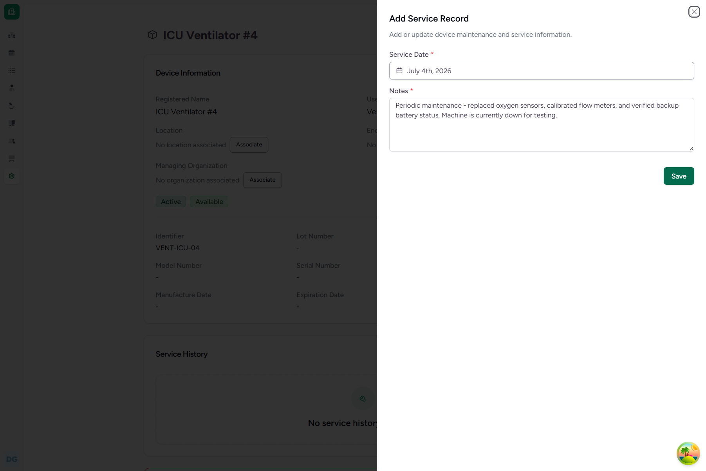
*Figure 37.1: Add Service Record side panel*

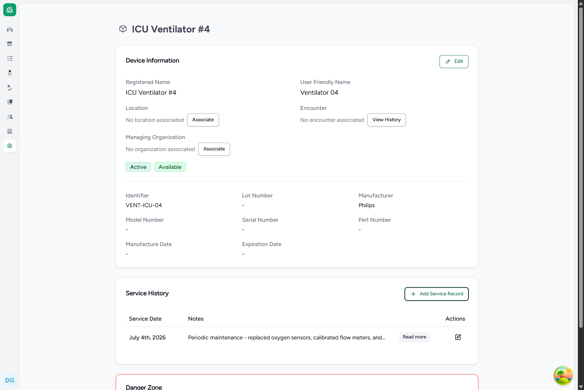
*Figure 37.2: Logged maintenance entry shown under the asset's Service History*

### Backend Technical Flow & Database Mapping
* **Django Model**: `DeviceServiceHistory` (located in [device.py](file:///c:/Projects/HealthcareSystems/care/care/emr/models/device.py))
* **Database Table**: `emr_deviceservicehistory`
* **Key Fields Written**:
  * `device_id`: `UUID` of the corresponding `Device`.
  * `serviced_on`: Timestamp of the record.
  * `note`: `"Periodic maintenance - replaced oxygen sensors, calibrated flow meters, and verified backup battery status. Machine is currently down for testing."`

---

## FLOW-38: Creating a Stock Purchase Request (Care to Odoo ERP Sync)

### Objective
Create a stock purchase order request from EMR that synchronizes with the Odoo ERP system to initiate external procurement.

### Step-by-Step UI Process
1. Navigate to the location's inventory dashboard (e.g., `Bio-Chemistry Lab` > **Inventory > Purchase Orders**).
2. Click **+ Create Order**.
3. In the order details form:
   * **Name**: Enter `Syringe Purchase Request - July 2026`.
   * **Vendor/Distributor**: Select a supplier (e.g., `Supplier Raghavan LLC`).
   * **Reason**: Select `Ward Stock`.
   * **Category**: Select `Non Stock`.
   * **Priority**: Choose `Routine`.
4. Click **Create** to initialize the order draft.
5. In the order details view under **Requested Items**, click **Add Item**.
6. Search and select the item (e.g., `Gloves` or similar clinical consumables) and enter the requested quantity (e.g., `100`).
7. Click **Save List**.
8. Once finalized, click **Mark as Approved** to finalize the request and sync it to the Odoo ERP.

### Screenshots
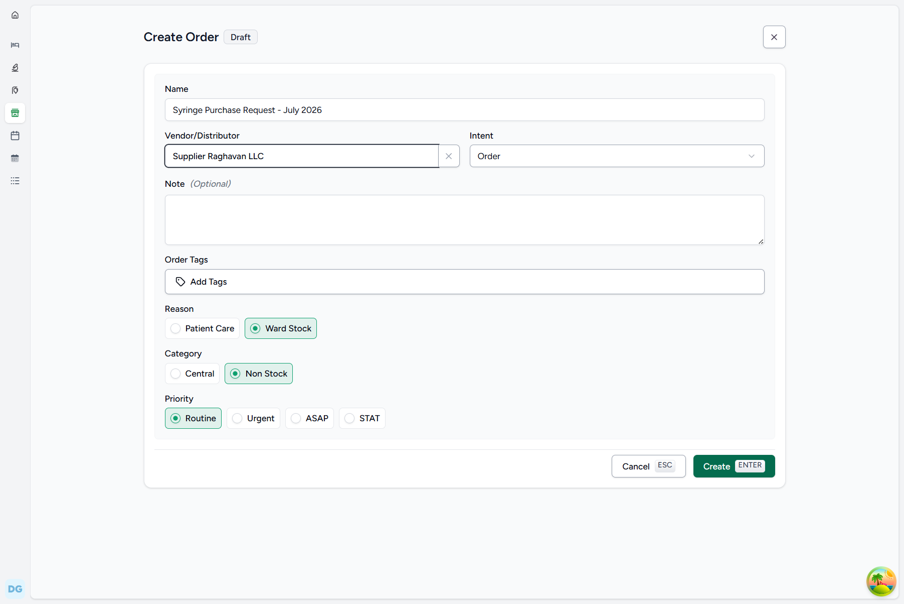
*Figure 38.1: Creating a new Purchase Order*

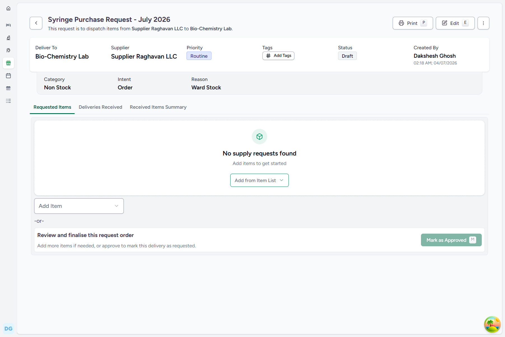
*Figure 38.2: Purchase Order draft details page*

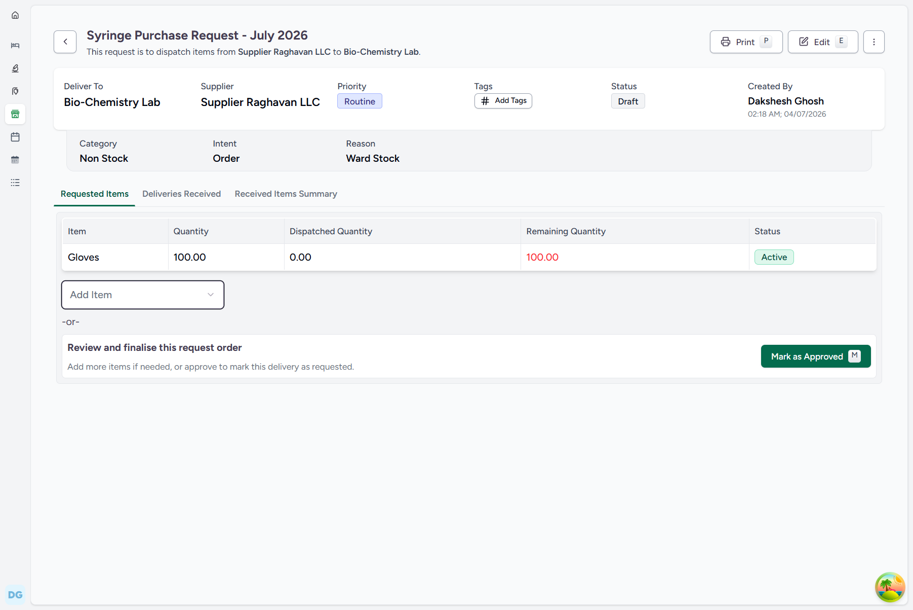
*Figure 38.3: Consumables added to the purchase request list*

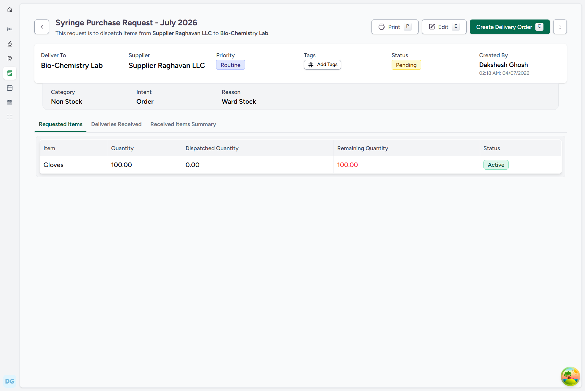
*Figure 38.4: Approved Purchase Order ready for Odoo sync*

### Backend Technical Flow & Database Mapping
* **Django Models**: 
  * `RequestOrder` (located in [supply_request.py](file:///c:/Projects/HealthcareSystems/care/care/emr/models/supply_request.py))
  * `SupplyRequest` (located in [supply_request.py](file:///c:/Projects/HealthcareSystems/care/care/emr/models/supply_request.py))
* **Database Tables**:
  * `emr_requestorder` (stores order header and status metadata)
  * `emr_supplyrequest` (stores line items, quantities, and associations to `ProductKnowledge`)
* **Key Fields Written**:
  * `name`: `"Syringe Purchase Request - July 2026"`
  * `supplier_id`: Organization UUID.
  * `status`: `"approved"`
  * `item_id`: ProductKnowledge UUID.
  * `quantity`: `100`

---

## FLOW-39: Receiving Stock Deliveries (Updates Local Inventory Counts)

### Objective
Record incoming deliveries of purchased stock to automatically increment local inventory counts.

### Step-by-Step UI Process
1. Navigate to the location's incoming deliveries list page (e.g., **Inventory > Purchase Deliveries**).
2. Click **+ Create Delivery**.
3. Fill in the delivery header:
   * **Name**: Enter `Glove Stock Delivery - July 2026`.
   * **Vendor/Distributor**: Select `Supplier Raghavan LLC`.
4. Click **Create** to save the delivery draft.
5. Click **Add Item** to add items received:
   * **Product**: Select `Gloves`.
   * **Batch #**: Enter `B-GL-202607`.
   * **Expiry**: Select date (e.g., `2028-12-31`).
   * **Pack Size**: `100`
   * **Pack Qty**: `10`
   * **Item Price**: `15`
   * **MRP**: `20`
6. Click **Save** to add the line item.
7. Click **Mark as Approved** to finalize the delivery, which automatically creates the stock lots and increments local inventory.
8. Navigate back to **Inventory > Summary** to view the updated counts.

### Screenshots
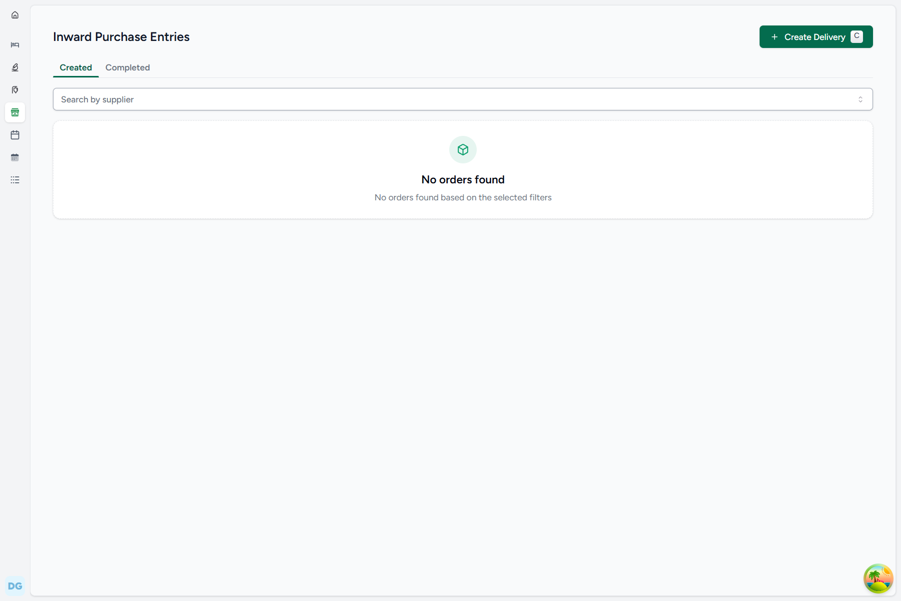
*Figure 39.1: Inward Purchase Entries list*

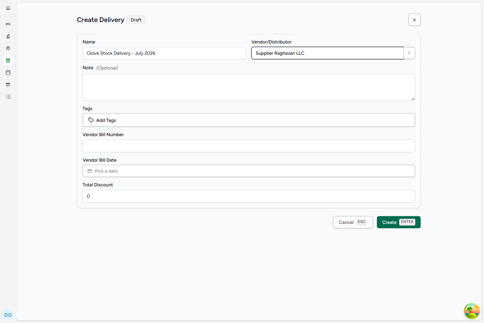
*Figure 39.2: Create Delivery header form*

*Figure 39.3: Logging details for received items*

*Figure 39.4: Delivery draft with added line items*

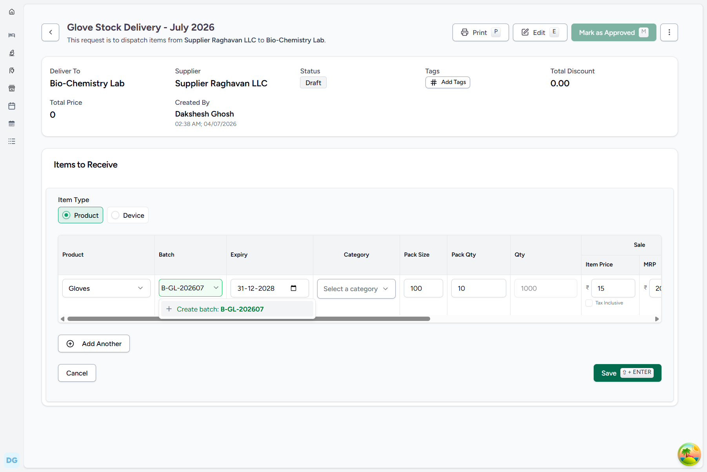
*Figure 39.5: Approved delivery status*

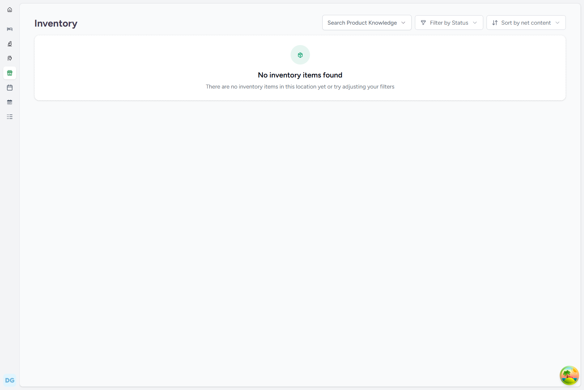
*Figure 39.6: Local Inventory Summary showing the updated Gloves stock count*

### Backend Technical Flow & Database Mapping
* **Django Models**:
  * `DeliveryOrder` (located in [supply_delivery.py](file:///c:/Projects/HealthcareSystems/care/care/emr/models/supply_delivery.py))
  * `SupplyDelivery` (located in [supply_delivery.py](file:///c:/Projects/HealthcareSystems/care/care/emr/models/supply_delivery.py))
  * `Product` (located in [product.py](file:///c:/Projects/HealthcareSystems/care/care/emr/models/product.py))
  * `InventoryItem` (located in [inventory_item.py](file:///c:/Projects/HealthcareSystems/care/care/emr/models/inventory_item.py))
* **Database Tables**:
  * `emr_deliveryorder` (stores delivery header and status metadata)
  * `emr_supplydelivery` (stores received quantities and reference prices)
  * `emr_product` (stores product batch and lot numbers)
  * `emr_inventoryitem` (stores actual updated stock quantities at locations)
* **Key Fields Written**:
  * `status`: `"approved"`
  * `supplied_item_pack_quantity`: `10`
  * `supplied_item_pack_size`: `100`
  * `supplied_item_quantity`: `1000` (auto-calculated)
