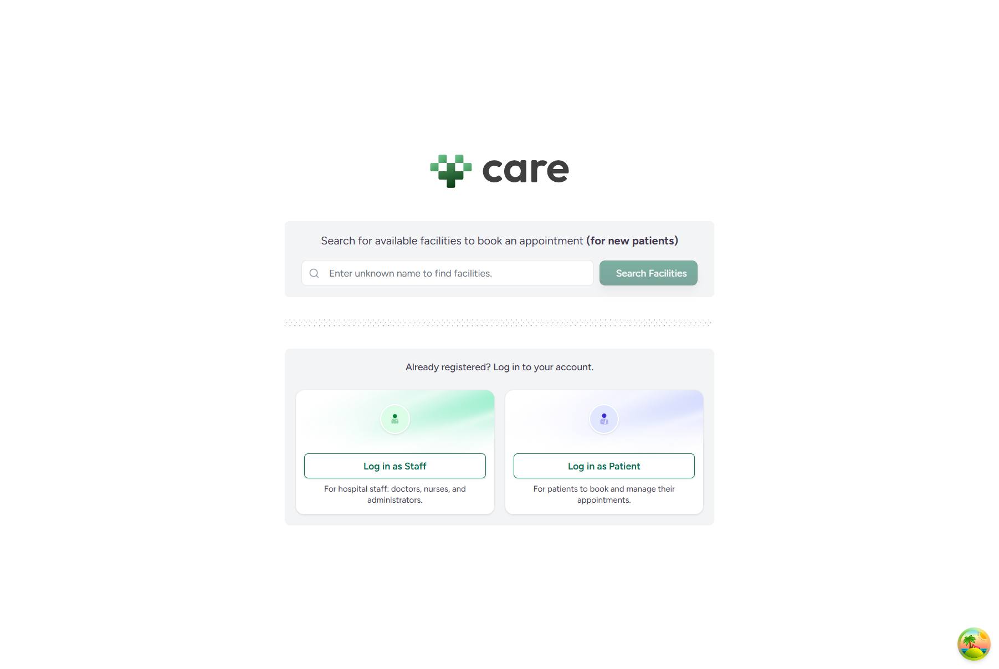
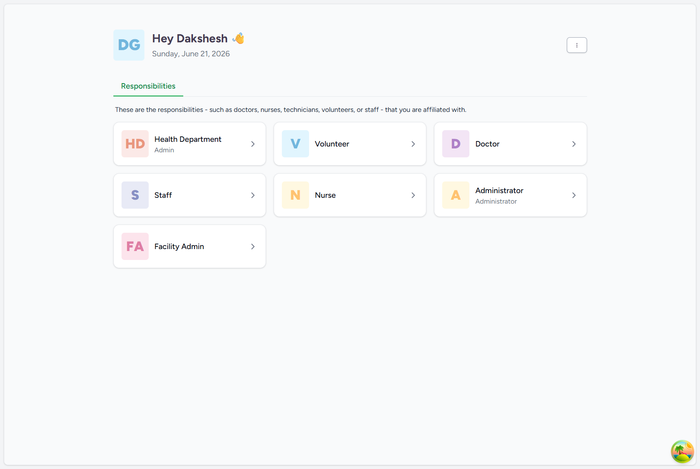
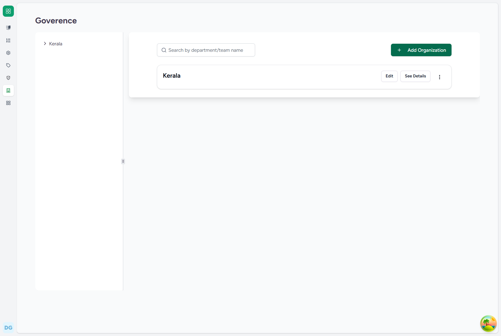

# Operational Flow Guide: Creating a State Organization (e.g., Kerala)
## FLOW-01: Creating a State Organization

This document provides a detailed, step-by-step user guide for registering a state-level organization in the CARE EMR system.

---

### 1. System Credentials
*   **Required Role**: Super Admin
*   **Default Username**: `care-admin`
*   **Default Password**: `Ohcn@123`

---

### 2. Step-by-Step UI Guide

#### Step 1: Access the Login Screen
Open the CARE EMR interface (running locally on `http://localhost:4000/`). You will see the main landing page. Click on the **Log in as Staff** button.

#### Step 2: Authenticate
Enter the default super admin credentials:
*   **Username**: `care-admin`
*   **Password**: `Ohcn@123`

Click **Login** to proceed to the system dashboard.

#### Step 3: Navigate to Governance Organizations
Navigate to the governance settings or type `http://localhost:4000/admin/organizations/govt` in the browser address bar. This loads the **Governance & Organization Hierarchy** registry.

#### Step 4: Open and Fill the Creation Form
Click the **Add Organization** button in the upper right. A side sheet form will slide open.
*   Enter the State Name (e.g. `Kerala Test`) into the **Name** field.
*   Leave the **Parent Organization** select/field blank as this is a top-level root organization.

#### Step 5: Save and Verify
Click the **Create Organization** button at the bottom of the form. The system will process the creation, display a toast saying "Organization created successfully", and the new state organization will immediately be listed in the governance tree.

---

### 3. Backend Technical Details
*   **Django Model**: `Organization` (located in [organization.py](file:///c:/Projects/HealthcareSystems/care/care/emr/models/organization.py))
*   **Database Write**: Inserts a new row in the `emr_organization` table.
*   **Key Database Fields**:
    *   `name`: `"Kerala Test"` (or `"Kerala"`)
    *   `org_type`: `"govt"`
    *   `parent_id`: `NULL`
    *   `level_cache`: `0`
