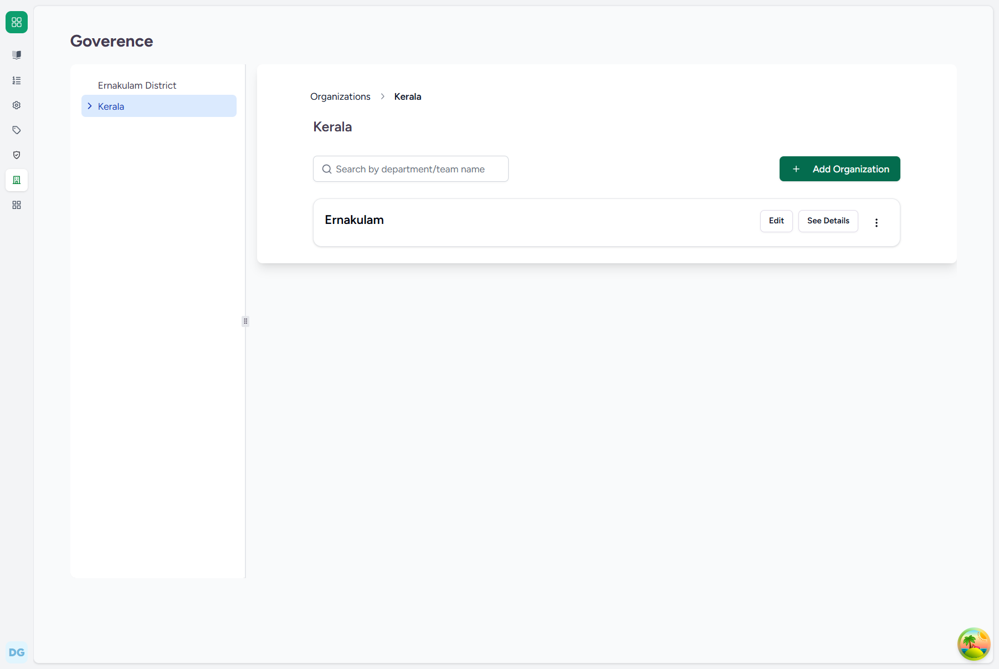
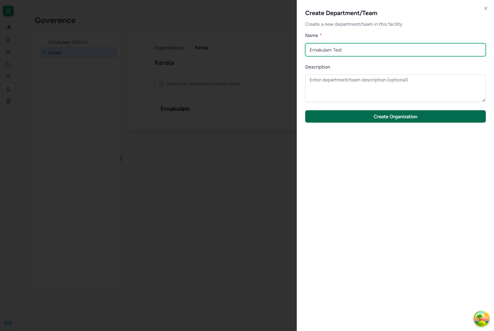
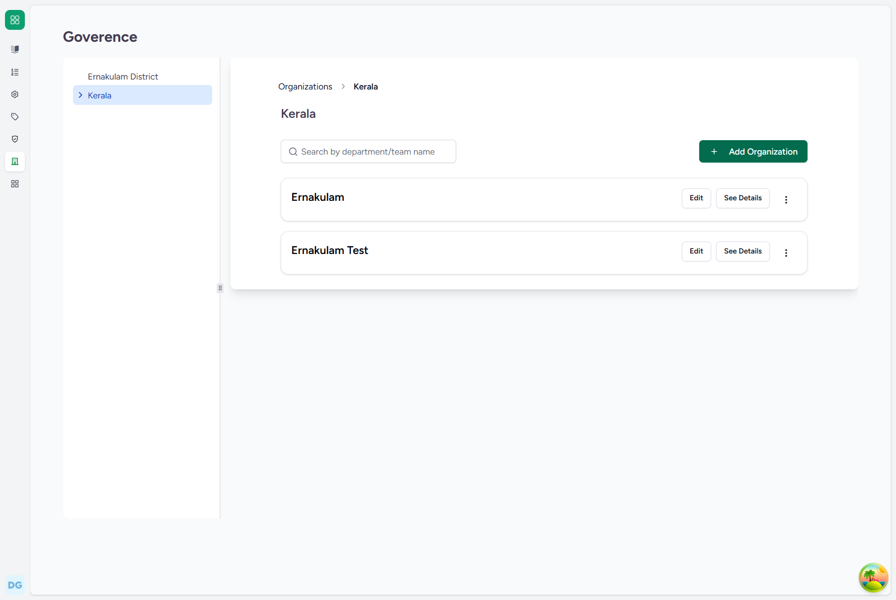

# Operational Flow Guide: Creating a District Organization (under the State)
## FLOW-02: Creating a District Organization

This document provides a detailed, step-by-step user guide for registering a district-level organization under an existing state organization in the CARE EMR system.

---

### 1. System Credentials
*   **Required Role**: Super Admin
*   **Default Username**: `care-admin`
*   **Default Password**: `Ohcn@123`

---

### 2. Step-by-Step UI Guide

#### Step 1: Open Parent State Details
Navigate to the parent State Organization details page (e.g. `http://localhost:4000/admin/organizations/govt/dc4e6a3c-06f8-4396-8f8f-8505e0456652` for `Kerala`).

#### Step 2: Open and Fill the District Form
Click the **Add Organization** button. A side sheet form will open.
*   Enter the District Name (e.g. `Ernakulam Test`) into the **Name** field.
*   (Since the form is opened from within `Kerala` detail view, the parent is automatically set to `Kerala` by the EMR routing system).

#### Step 3: Create and Verify
Click the **Create Organization** button at the bottom of the form. The system will process the creation, display a success toast, and the new district organization will immediately be listed in the sub-organizations view of the state.

---

### 3. Backend Technical Details
*   **Django Model**: `Organization` (located in [organization.py](file:///c:/Projects/HealthcareSystems/care/care/emr/models/organization.py))
*   **Database Write**: Inserts a new row in the `emr_organization` table.
*   **Key Database Fields**:
    *   `name`: `"Ernakulam Test"` (or `"Ernakulam"`)
    *   `org_type`: `"govt"`
    *   `parent_id`: `[Kerala State UUID]`
    *   `level_cache`: `1`
    *   `parent_cache`: `[Kerala_ID]` (populated automatically by `set_organization_cache()`)
