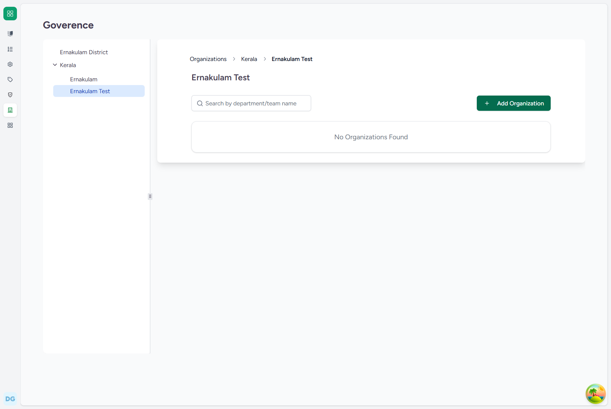
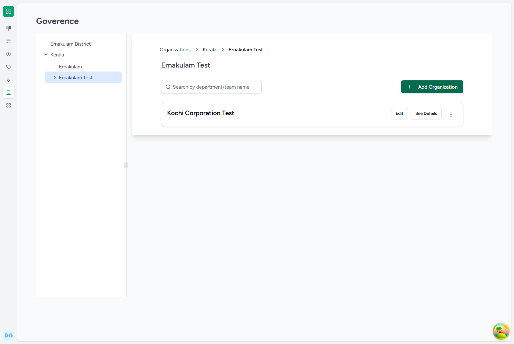

# Operational Flow Guide: Creating a Local Body Organization (under the District)
## FLOW-03: Creating a Local Body Organization

This document provides a detailed, step-by-step user guide for registering a local body-level organization under an existing district organization in the CARE EMR system.

---

### 1. System Credentials
*   **Required Role**: Super Admin
*   **Default Username**: `care-admin`
*   **Default Password**: `Ohcn@123`

---

### 2. Step-by-Step UI Guide

#### Step 1: Open Parent District Details
Navigate to the parent District Organization details page (e.g. `http://localhost:4000/admin/organizations/govt/2a8a0c4f-8a86-4f38-97c1-3422b91dae01` for `Ernakulam Test`).

#### Step 2: Open and Fill the Local Body Form
Click the **Add Organization** button. A side sheet form will open.
*   Enter the Local Body Name (e.g. `Kochi Corporation Test`) into the **Name** field.
*   (Since the form is opened from within `Ernakulam Test` detail view, the parent is automatically set to `Ernakulam Test` by the EMR routing system).

#### Step 3: Create and Verify
Click the **Create Organization** button at the bottom of the form. The system will process the creation, display a success toast, and the new local body organization will immediately be listed in the sub-organizations view of the district.

---

### 3. Backend Technical Details
*   **Django Model**: `Organization` (located in [organization.py](file:///c:/Projects/HealthcareSystems/care/care/emr/models/organization.py))
*   **Database Write**: Inserts a new row in the `emr_organization` table.
*   **Key Database Fields**:
    *   `name`: `"Kochi Corporation Test"` (or `"Kochi Corporation"`)
    *   `org_type`: `"govt"`
    *   `parent_id`: `[Ernakulam District UUID]`
    *   `level_cache`: `2`
    *   `parent_cache`: `[Kerala_ID, Ernakulam_ID]` (populated automatically by `set_organization_cache()`)
