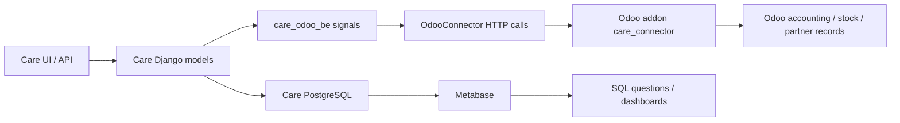

# Metabase and Odoo Integration Guide

This guide shows how to run Care analytics queries in Metabase and how the Odoo bridge is wired in this repo.

## 1) How to run queries in Metabase

Metabase is connected directly to the Care PostgreSQL database. Use **New > SQL query** and select the Care database. Then paste one of the queries below, or adapt one of the query files in this folder.

The repository already uses Metabase-friendly query patterns such as optional filters:

```sql
--[[AND {{DATE}}]]
--[[AND {{Status}}]]
```

That means the same query can be run with or without dashboard filters.

### Query 1: Invoice report

Use this to list invoices, patients, SSMM ID, status, and who last updated the record.

```sql
SELECT
    emr_invoice.number AS invoice_number,
    emr_patient.name AS patient_name,
    pi.value AS ssmm_id,
    emr_invoice.total_gross,
    emr_invoice.status,
    emr_invoice.modified_date,
    TRIM(COALESCE(users_user.prefix || ' ', '') || users_user.first_name || ' ' || COALESCE(users_user.last_name, '')) AS updated_by
FROM emr_invoice
JOIN users_user ON emr_invoice.updated_by_id = users_user.id
JOIN emr_patient ON emr_invoice.patient_id = emr_patient.id
LEFT JOIN emr_patientidentifier pi
    ON emr_patient.id = pi.patient_id
   AND pi.config_id = 21
WHERE emr_invoice.deleted = FALSE
  --[[AND {{DATE}}]]
  --[[AND {{Status}}]]
ORDER BY emr_invoice.modified_date DESC;
```

### Query 2: Most sold items

Use this for stock/dispense analysis and margin tracking.

```sql
SELECT 
    pk.name AS stock_name,
    SUM(md.quantity) AS total_quantity_dispensed,
    SUM(ci.total_price) AS selling_price,
    SUM(p.purchase_price * md.quantity) AS purchase_price,
    SUM(ci.total_price - (p.purchase_price * md.quantity)) AS total_margin
FROM emr_medicationdispense md
JOIN emr_chargeitem ci ON md.charge_item_id = ci.id
JOIN emr_chargeitemdefinition cid ON ci.charge_item_definition_id = cid.id
JOIN emr_product p ON p.charge_item_definition_id = cid.id
JOIN emr_productknowledge pk ON p.product_knowledge_id = pk.id
WHERE md.status IN ('completed', 'in_progress', 'preparation')
  AND md.deleted = FALSE
  AND ci.status IN ('billed', 'paid')
  --[[AND pk.name = {{stock_name}}]]
  --[[AND {{DATE}}]]
GROUP BY pk.name
ORDER BY total_quantity_dispensed DESC;
```

### Query 3: Revenue by service area

This is a lightweight pattern you can adapt for lab, xray, pharmacy, or other service lines.

```sql
SELECT
    DATE_TRUNC('month', emr_invoice.modified_date) AS month,
    COUNT(*) AS invoice_count,
    SUM(emr_invoice.total_gross) AS gross_revenue
FROM emr_invoice
WHERE emr_invoice.deleted = FALSE
  AND emr_invoice.status IN ('issued', 'balanced', 'paid')
  --[[AND {{DATE}}]]
GROUP BY 1
ORDER BY 1;
```

### How to use these in Metabase

1. Open Metabase at `http://localhost:3000`.
2. Click **New** and choose **SQL query**.
3. Select the Care database connection.
4. Paste one of the queries above.
5. If the query has `{{...}}` filters, define the filter types in Metabase when prompted.
6. Run the query and save it as a question or dashboard card.

## 2) How Odoo is integrated

The Odoo integration is a sync bridge between Care and Odoo, not a separate user-facing sales module inside Care.

### Main pieces

- [care/plug_config.py](../care/plug_config.py) registers the `care_odoo` plug.
- [care_odoo_be/src/care_odoo/signals.py](../care_odoo_be/src/care_odoo/signals.py) pushes Care events into Odoo.
- [care_odoo_be/src/care_odoo/management/commands/sync_to_odoo.py](../care_odoo_be/src/care_odoo/management/commands/sync_to_odoo.py) supports manual and bulk sync.
- [odoo_connector/care_connector/__manifest__.py](../odoo_connector/care_connector/__manifest__.py) defines the Odoo addon used on the ERP side.

### What is synced automatically

- Users
- Invoices
- Payments / reconciliations
- Products / charge items
- Categories
- Supplier organizations
- Completed delivery orders that are meant to become vendor-bill style records in Odoo

### What the Odoo sales side means here

In this codebase, “sales” mostly means the accounting and billing flow around what Care bills, not Odoo CRM-style quotations.

In practice:

- Care creates or updates invoices and payments.
- The plugin sends those records to Odoo through the connector layer.
- Odoo receives invoice/payment/product/partner data so billing and ERP reporting stay aligned.
- Metabase reads the Care database directly for analytics, so reporting is based on Care’s source-of-truth data.

### Important detail

The Odoo addon manifest currently depends on `base`, `stock`, `contacts`, and `account`. That means the integration is centered on accounting, stock, and partner records. It is not a full quotation/sales-order pipeline unless you add the corresponding Odoo sale modules and mapping code.

## 3) Sync flow diagram



## 4) Practical commands

Run a full sync from the Care backend container or virtual environment:

```bash
python manage.py sync_to_odoo all
```

List available sync targets:

```bash
python manage.py sync_to_odoo list
```

Check whether Care can reach Odoo:

```bash
python manage.py check_odoo_connection
```

## 5) Good starting points for dashboards

- Invoice revenue and status: [care_analytics_sql/Care/Accouting/invoicereport_ssmm.md](./Care/Accouting/invoicereport_ssmm.md)
- Most sold items: [care_analytics_sql/Care/Operations/mostsold_ssmm.md](./Care/Operations/mostsold_ssmm.md)
- Monthly revenue patterns: use the example above and adapt it for your facility or service line.
