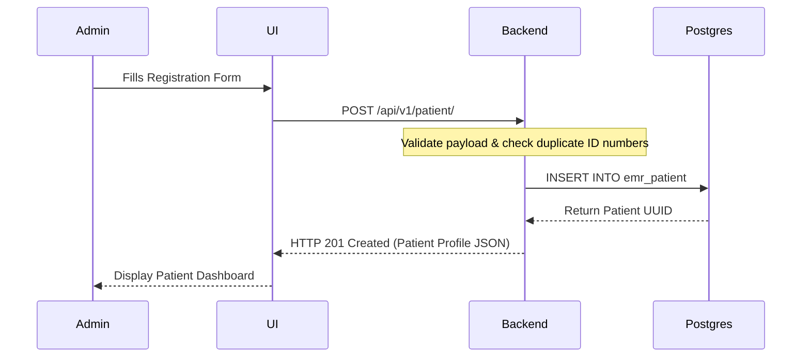
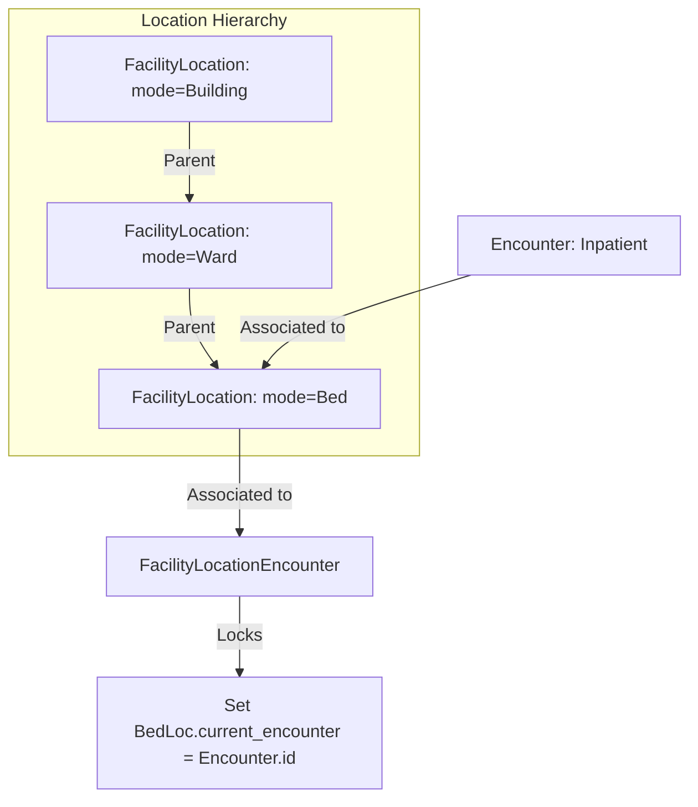
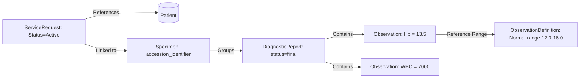

# Open Source Healthcare Systems
## Operational Workflows & System Flows Documentation (`flows.md`)

This document provides step-by-step training and documentation on how the primary clinical and administrative workflows operate inside the integrated Care EMR platform. It maps the layperson user interface (UI) steps directly to the underlying database schemas, models, and states to serve as a comprehensive guide for real-world deployment and training.

---

## 1. Patient Registration Workflow

### A. Layperson / Administrative UI Flow
To register a new patient in the Care clinical system:
1.  **Navigate to Patients**: Log in to Care EMR and click **Patients** in the primary navigation sidebar or go to `/patient`.
2.  **Initiate Registration**: Click the **Register Patient** button in the top right.
3.  **Basic Information**: Fill out the basic demographic fields:
    *   **First Name** & **Last Name** (Required)
    *   **Date of Birth** (Required for age verification)
    *   **Gender** (Required: Male, Female, Non-binary, etc.)
    *   **Phone Number** (Used for notifications and OTP-based verification)
4.  **Identification Details**: Select an **Identification Type** (e.g., Aadhaar, Voter ID, Passport) and enter the corresponding **ID Number**.
5.  **Address & Location**: Fill out state, district, local body, and residential address coordinates.
6.  **Emergency Contact**: Enter the name, relationship, and contact details of the primary emergency contact person.
7.  **Submit Registration**: Click **Register Patient**. The UI transitions to the newly created Patient Profile View showing their generated clinical ID.

### B. Backend Technical & Database Flow
When a user clicks "Register Patient", the React frontend submits a `POST` request to `/api/v1/patient/`.

*   **Main Database Table**: `emr_patient` (mapped to `care.emr.models.Patient`)
*   **Key Fields**:
    *   `id` (UUID Primary Key)
    *   `name` (Varchar - combined first/last name)
    *   `gender` (Varchar/Choice)
    *   `date_of_birth` (Date)
    *   `phone_number` (Varchar)
    *   `address` (Text)
    *   `emergency_contact_name` / `emergency_contact_phone` (Varchar)
*   **Secondary Verification Table**: `facility_patientmobileotp` (tracks authentication logs for OTP-based clinical logins).

---

## 2. Bed Allocation & Location Assignment Flow

In Care EMR, beds are not treated as independent floating assets. Instead, the platform utilizes a **FHIR-compliant hierarchical Location model** where beds are child nodes of rooms, wards, or wings.

### A. Layperson / Administrative UI Flow

#### Phase 1: Creating Facilities & Bed Hierarchies (Admin Setup)
1.  Go to **Facilities** in the admin console and select your Hospital/Clinic.
2.  Click **Locations** and select **Add Location**.
3.  Create the hierarchy:
    *   *Root Location*: e.g., "Building A" (Location Type: `Building`)
    *   *Child Location*: e.g., "ICU Ward 2" (Location Type: `Ward`, Parent: "Building A")
    *   *Grandchild Location (The Bed)*: e.g., "Bed 104" (Location Type: `Bed`, Parent: "ICU Ward 2")
4.  Set the bed's status to **Active** and operational status to **Unoccupied**.

#### Phase 2: Admitting a Patient & Allocating a Bed
1.  Open the profile of a registered patient.
2.  Click **Create Encounter** (or **Admit Patient**) to open a consultation/admission card.
3.  Set the encounter type to **Inpatient / Admission**.
4.  Under **Location/Bed Assignment**, browse the facility location tree.
5.  Select **Bed 104** (the system only displays unoccupied beds).
6.  Set the admission date/time and click **Confirm Admission**.
7.  *UI Result*: The bed's status changes to **Occupied**, showing the patient's name. The patient's encounter card displays "Location: Building A > ICU Ward 2 > Bed 104".

#### Phase 3: Bed Transfer & Discharges
1.  *Transfer*: Go to the patient's active Encounter panel, click **Transfer Location**, select a new unoccupied bed (e.g., "Bed 105"), and save.
2.  *Discharge*: Click **Discharge Patient**. The encounter is closed, and the bed status reverts to **Unoccupied** in real-time.

### B. Backend Technical & Database Flow

*   **Location Model**: `FacilityLocation` (mapped to `care.emr.models.FacilityLocation` in `c:\Projects\HealthcareSystems\care\care\emr\models\location.py`)
    *   `parent`: Foreign Key to `self` (creates the Building ➔ Ward ➔ Room ➔ Bed tree structure).
    *   `location_type`: JSONField storing FHIR system codes (defining if a node is a bed or a room).
    *   `current_encounter`: ForeignKey pointing to `Encounter` (locks the bed when occupied; NULL when vacant).
*   **Transaction Log Model**: `FacilityLocationEncounter` (stores the timeline of bed occupancy)
    *   `encounter_id`: ForeignKey to `Encounter`
    *   `location_id`: ForeignKey to `FacilityLocation` (the bed)
    *   `start_datetime`: DateTime patient entered the bed.
    *   `end_datetime`: DateTime patient vacated the bed (populated during transfers or discharges).

---

## 3. Laboratory Workflows (Labs, Tests, & Specimen Lifecycle)

Laboratory workflows track a test order from a doctor's initial request to sample collection, laboratory processing, and final result visualization.

### A. Layperson UI Flow

#### Step 1: Doctor Orders a Lab Test (Service Request)
1.  During a patient consultation, the doctor opens the **Orders & Tests** panel.
2.  Click **Order Lab Test**.
3.  Select the test category (e.g., Blood Panel, Hematology) and the specific test (e.g., Complete Blood Count - CBC).
4.  Enter priority (Routine, Urgent, Stat), intent, and instructions for the lab staff.
5.  Click **Place Order**. A new **Service Request** is created in a "Pending" state.

#### Step 2: Specimen Collection by Lab Tech
1.  The laboratory technician opens the facility's **Lab Queue** dashboard.
2.  Locate the pending **Service Request** for the patient.
3.  Click **Collect Specimen**.
4.  Enter details:
    *   **Specimen Type**: Blood, Urine, Sputum, etc.
    *   **Accession Identifier**: Scan or write the barcode label stuck on the physical sample tube.
    *   **Collection Date/Time** & collector name.
5.  Click **Register Specimen**. The status of the specimen changes to "Collected".

#### Step 3: Recording Results (Observations & Diagnostic Report)
1.  Once the lab finishes analyzing the sample, the lab tech returns to the patient profile.
2.  Select the specimen record and click **Enter Lab Results**.
3.  A form displays individual fields based on the ordered test template (e.g. for CBC: Hemoglobin, WBC count, RBC count).
4.  Enter numeric values and notes (e.g. Hemoglobin: `13.5 g/dL`).
5.  Click **Finalize Report**.
6.  *UI Result*: A **Diagnostic Report** card is generated in the patient's file. The doctor is notified, and individual readings appear in the patient's vitals/vitals trends chart.

### B. Backend Technical & Database Flow

The lab database model is divided into request containers, sample containers, and result metrics:

#### Underlying Relational Database Tables:
1.  **`emr_servicerequest`** (mapped to `ServiceRequest` in `c:\Projects\HealthcareSystems\care\care\emr\models\service_request.py`):
    *   Tracks the request metadata: `title`, `category` (e.g. laboratory), `status` (active, completed), `priority`, and `requester_id` (User ID of the doctor).
2.  **`emr_specimen`** (mapped to `Specimen` in `c:\Projects\HealthcareSystems\care\care\emr\models\specimen.py`):
    *   Tracks the physical sample tube details: `accession_identifier` (barcode ID), `specimen_type` (JSON detailing the sample format), and `received_time`.
3.  **`emr_diagnosticreport`** (mapped to `DiagnosticReport` in `c:\Projects\HealthcareSystems\care\care\emr\models\diagnostic_report.py`):
    *   Groups the observations: `status` (preliminary, final), `conclusion` (text field for lab notes), and binds the `Patient`, `Encounter`, and original `ServiceRequest` together.
4.  **`emr_observation`** (mapped to `Observation` in `c:\Projects\HealthcareSystems\care\care\emr\models\observation.py`):
    *   Tracks the raw readings: `value` (JSONField storing numerical values or valuesets), `note`, and `interpretation` (JSONField indicating Low, Normal, High).
    *   References `emr_observationdefinition` (metadata schemas containing standard reference ranges for blood glucose, hemoglobin, etc.).
